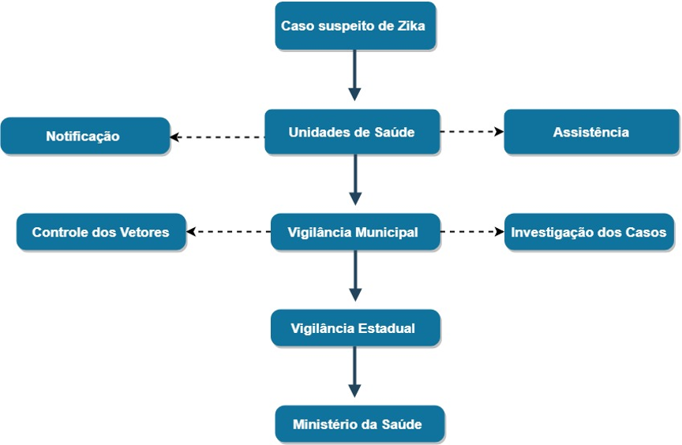

\fontsize{12pt}{12pt}\selectfont
\newpage
```{r, include=FALSE}
rm(list=ls())

if (!require("pacman")) install.packages("pacman")
pacman::p_load(epitools,grid, 
               tidyverse,read.dbc,
               flextable, geobr,
               purrr,foreign,
               data.table,stringr,
               devtools,ggpubr,
               WriteXLS,reshape2,
               broom,dunn.test,
               kableExtra,questionr,
               officer,gridExtra,
               sf, MASS, scales, webshot)

knitr::opts_chunk$set(echo = TRUE, fig.align="center", fig.pos = 'H')
run_num <- run_autonum(seq_id = "Tabela", pre_label = "Tabela ", bkm = "iris_table")
doc.type <- knitr::opts_knit$get('rmarkdown.pandoc.to')

```


```{r, include=FALSE}
z16<-read.dbf("ZIKA_2016.dbf")
z17<-read.dbf("ZIKA_2017.dbf")
z18<-read.dbf("ZIKA_2018.dbf")

zika_geral<-full_join(z16, z17)
zika_geral<-full_join(zika_geral, z18)

pop<-read_csv2("populacao.csv")%>%
  dplyr::select(!Total)%>%
  gather(RO:DF,key="Estado", value="População")%>%
  mutate(Ano=as.factor(Ano))
```


\begin{blackbox}
\begin{center}
Avaliação de Sistema de Vigilância Epidemiológica - Zika
\end{center}
\end{blackbox}


**Autores**:  
  
&nbsp;&nbsp;&nbsp;Marcela Lopes Santos, (ORCID:<https://orcid.org/0000-0002-1283-7962>)  

Carolina Musso, (ORCID: <https://orcid.org/0000-0002-8107-6458>)  

Beatriz Amaral (ORCID: <https://orcid.org/0000-0002-3201-5691>)  

Vanessa Porto (ORCID:<https://orcid.org/0000-0002-7313-6633>)  

Veruska Maia (ORCID:<https://orcid.org/000-002-6829-8582>)  

Rafaella Albuquerque (ORCID:<https://orcid.org/0000-0003-1103-6482>)  

Jonas Brant  (ORCID:<https://orcid.org/:0000-0003-2248-9102>)  


**Afiliação**: Universidade de Brasília (UnB)  

**Agradecimentos**:  

Estagiária Stella Gomes Alves dos Santos.
Faculdade de Ciências da Saúde da Universidade de Brasília (UnB), Departamento de Vigilância das Doenças Transmissíveis da Secretaria de Vigilância em Saúde do Ministério da Saúde (DEVIT/SVS/MS)

\begin{blackbox}
\begin{center}
Stakeholders
\end{center}
\end{blackbox}

Coordenação-Geral de Vigilância das Arboviroses - CGARB, Secretarias de Saúdes Estaduais, Distrital e Municipais representados pelos gestores e técnicos envolvidos na vigilância epidemiológica da Zika.

\newpage
# INTRODUÇÃO  

&nbsp;&nbsp;&nbsp;&nbsp;&nbsp;O vírus Zika (ZIKV) pertence ao gênero Flavivirus e família Flaviviridae, conhecidas e descritas em duas linhagens do vírus, uma africana e outra asiática, sendo a segunda responsável pelos casos na Indonésia, Micronésia e Brasil (JUNIOR et, 2015). Essa segunda linhagem surge com a mutação do vírus, motivo pelo qual aumenta a eficiência de transmissão dos humanos para mosquitos, resultando em uma prevalência mais elevada (ALVES, 2018).

A forma de transmissão ocorre por meio de vetores Aedes (Ae. aegypti and Ae. albopictus), mas também é descrita por transmissão congênita, transplante de órgãos e medula óssea, transfusão sanguínea, via sexual e na exposição laboratorial (BRASIL, 2016a; BRASIL, 2017a; SES-PR, 2017). As consequências financeiras para o país vão além do custo com medidas de prevenção, diagnóstico e tratamento. T(dores crônicas e efeitos neurológicos).

O processo de avaliação de sistemas de vigilância é fundamental para evidenciar a sua eficácia e eficiência, bem como propor recomendações, considerando a dinamicidade dos sistemas. Além disso, é uma estratégia implementada por vários países e no Brasil essa rotina tem sido feita pelo Ministério da Saúde (MS).  

A necessidade de avaliações contínuas de sistemas de vigilância é contemplada no projeto Arbocontrol, em sua meta 7, definida por elaborar o diagnóstico de sistemas de informação entomológico, ambientais, epidemiológicos e assistenciais disponíveis no Ministério da Saúde e o uso de evidências para fornecer respostas e apoiar a tomada de decisão. 
\newpage

# OBJETIVOS

## Geral

Avaliar o sistema de vigilância epidemiológica do Zika quanto sua eficácia e eficiência e propor recomendações no âmbito nacional no período de 2016 a 2018.

## Específicos

+	Descrever a importância da vigilância epidemiológica da Zika.
+	Descrever o sistema de vigilância epidemiológica do Zika.
+	Identificar o nível de utilidade do sistema de vigilância epidemiológica do Zika.
+	Avaliar o sistema de vigilância epidemiológica segundo os atributos quantitativos e qualitativos do Update Guidelines for Evaluating Surveillance Systems do Centers for Disease Control and Prevention.
+	Propor recomendações para aperfeiçoar o sistema de vigilância epidemiológica do Zika.

\newpage
# METODOLOGIA

**Local do estudo:** Brasil considerando suas 26 Unidades Federadas (UF) e o Distrito Federal (DF), que compreendem 5.770 municípios distribuídos em cinco Regiões. A população brasileira é de 211.902.245 habitantes, com extensão geográfica de 8.514.876 Km2 (DATASUS, 2010). A vigilância epidemiológica do Zika é realizada nos níveis nacional, estadual, Distrital e municipal.  

**Período do estudo:** 2016 e 2018  

**Delineamento do estudo:** Estudo observacional, descritivo, no qual visa evidenciar a situação atual do sistema de vigilância epidemiológica do Zika, a partir dos dados disponíveis e perspectivas dos atores envolvidos.  

**Metodologia de análise: ** Aplicação do Updated Guidelines for Evaluating Public Health Surveillance Systems do Centers for Disease Control and Prevention (CDC, 2001).  

**Parâmetros de análise:** Descrever a importância do evento; do sistema de vigilância; avaliar o sistema por meio dos atributos qualitativos (simplicidade, flexibilidade, estabilidade), atributos quantitativos (qualidade dos dados, valor preditivo positivo, representatividade e oportunidade) conforme matriz avaliativa (Apêndice I).  

**Fonte de dados:** Secundários quanto evidências científicas, normativas, guias, acesso a base de dados nacionais, e primários quanto a percepção dos atores envolvidos na vigilância.  

**Análise de dados:** Estatística descritiva, expressada por meio de frequência, distribuição no tempo, espaço. Testes de hipótese quando pertinente. Utilizou-se os softwares Tabwin® versão 3.6, Microsoft Excel 2013®, R for Windows 3.5.2 e RStudio Desktop 1.1.463 para as análises qualitativas e quantitativas.

**Apresentação dos dados:** Os dados apresentam-se em forma texto, tabelas, quadros e mapas.  

**Aspectos éticos:**Aprovado no Comitê de Ética em Pesquisa (CEP) UnB, CAEE 98424818.2.0000.0030, Número do Parecer: 3.052.596.  

\newpage
# DESCRIÇÃO DO SISTEMA

## Descrever a importância do sistema sob vigilância  


&nbsp;&nbsp;&nbsp;&nbsp;&nbsp;No ano de 1947, registram-se os primeiros relatos do vírus da ZIKA, identificado no monitoramento de febre amarela selvagem, na Uganda. Alguns anos depois em 1952, surge os primeiros casos em humanos, na mesma localidade e na República da Tanzânia (WHO, 2016). Anos depois, ocorre o primeiro surto na região do Pacífico, em 2007, na Ilha do Pacífico de Yap e nos Estados Federados da Micronésia, afetando cerca de 73% dos residentes na ilha de Yap, mas nenhum dos casos exigiu hospitalização e o surto foi controlado em apenas três meses (DUFFY et al, 2009).

Entretanto a partir de 2013, o vírus Zika acometeu a Polinésia Francesa, causando cerca de 30.000 casos. Inicialmente não demonstram possuir gravidade, no entanto profissionais de saúde identificaram um aumento alarmante nos casos de Síndrome de Guillain-Barré, uma complicação neurológica grave e geralmente rara (CHAN, 2017).  

A constatação da primeira circulação do vírus do Zika nas Américas se deu em fevereiro de 2014 na Ilha de Páscoa e Chile, tendo casos registrados até junho de 2014. Já em 2015 o Brasil registrou seus primeiros casos no mês de maio e em outubro do mesmo ano, as autoridades da Colômbia também notificaram caso autóctone de infecção pelo Zika. No estado da Bolívia, os números de casos foram registrados nas 26 entidades territoriais das 36 existentes. No mês seguinte do mesmo ano, El Salvador, Guatemala, México, Paraguai, Suriname e Venezuela, também confirmaram a circulação autóctone do vírus Zika (WHO, 2015).  

Os primeiros relatos de casos de Zika no Brasil foram estabelecidos sob diferentes hipóteses quanto à sua dispersão. Uma dessas teorias consiste que ao decorrer dos eventos esportivos da Copa das Confederações em 2013, Copa do Mundo ou campeonato mundial de canoagem em 2014 tenha ocorrido a entrada do vírus em solo brasileiro, justificado pela grande circulação de pessoas de diferentes partes do mundo. Entretanto, também pode ter sido motivado por meio da imigração de haitianos e militares brasileiros em missão de paz no Haiti, teoria mais aceita no momento (ARGENTA, 2018; BRASIL, 2017d).  

Apesar de mostrar-se uma doença pouco agressiva, com casos leves e sem grandes complicações, em 2015 observou-se que esta estava associada ao aumento da ocorrência de microcefalia (). No início de 2016, estudo realizados verificaram uma forte associação entre a infecção por Zika vírus em gestantes e a ocorrência de condições específicas no recém-nascido, no qual a microcefalia era apenas umas das complicações visíveis. 

A dispersão da infecção pelo vírus zika e suas consequências associadas como microcefalia em recém-nascidos e impactos no sistema neurológico, detectadas no Brasil e que se expandiu pelas Américas, e posteriormente, envolveu mais de 73 países nos 5 continentes, torna-se uma Emergência de Saúde Pública de Importância Internacional (ESPII) declarada pela Organização Mundial de Saúde (OMS), como definido no regulamento sanitário internacional (RSI) (BRASIL, 2017b). Além disso, os casos envolvidos e confirmado com a transmissão autóctone da transmissão do vetor da doença causada pelo zika vírus envolvem cerca de 48 países e territórios das Américas e 26 países relataram casos confirmados de síndrome congênita associada à infecção (HABY, 2018).  

Desde a declaração da OMS estabeleceu-se um conjunto de ações estratégicas para a detecção, gestão clínica e envolvimento da comunidade contra a infecção pelo vírus zika e suas consequências associadas detectadas, além de agenda internacional de pesquisas em resposta a emergência, já que caracteriza-se um agravo de importância de saúde pública, que deve estar sob vigilância constante, inclusive de notificação. Dessa forma busca uma melhoria na vigilância, detecção de infecções, malformações congênitas e complicações neurológicas, juntamente com a intensificação do controle de mosquitos e acelerar o desenvolvimento de testes de diagnóstico e vacinas (BRASIL, 2016h). 

As gestantes mais vulneráveis a desenvolver recém-nascidos com microcefalia devido ao ZIKV são as jovens (18 a 24 anos) e de baixo nível econômico, fato observado no Brasil, onde a classe social mais baixa apresenta maior incidência de casos de microcefalia. 

Os dados do vírus Zika e suas associações aumentam as morbidades hospitalares, como as internações hospitalares considerando o tipo de gravidade, que oscila como as outras arboviroses em tempo médio de permanência. Estima-se uma média de 4 dias de tempo de internação, entretanto, ocorre aumento que pode ser interpretado como uma reação aos casos graves e a morbidades ocasionados por esse vírus.  

Um investimento de médio a longo prazo voltado para o desenvolvimento de terapias antivirais é fundamental para reduzir os casos notificados e a internação pelo agravo tendo em vista a exposição de gestantes, consideradas casos prioritários (BRASIL, 2017b). Existem iniciativas voltadas para criação de vacina contra zika, em destaque o acordo internacional entre o Instituto Evandro Chagas (IEC) e da Fundação Oswaldo Cruz (Fiocruz) e a Universidade do Texas Medical Branch (UTMB), dos Estados Unidos, no valor de R\$ 10 milhões de reais, que teve como objetivo realizar simultaneamente ensaios pré-clínicos no Brasil e nos EUA e a etapa de testes em camundongos na UTMB e em macacos no Belém (IEC) (BRASIL, 2017d).  Além do anúncio de investimento de R\$ 5,6 milhões do Ministério da Saúde do Brasil no financiamento da vacina contra o vírus Zika, outro investimento na ordem de R\$ 6 milhões direcionado ao projeto de pesquisa sobre Zika e Microcefalia, com parceria firmada entre a Fiocruz e o National Institutes of Health (NIH) – agência de saúde do governo norte-americano. Além disso, cerca de R$ 8,5 milhões em contrato com o Instituto Butantan para o desenvolvimento de imunizações contra a Zika: soros e anticorpos monoclonais (BRASIL, 2016b). 

Apesar do número de pesquisas e esforços científicos ainda não existe vacina para vírus da Zika e suas associações, assim, as medidas de prevenção e controle dos vetores Aedes são fundamentais para reduzir os custos e evitar novos surtos das doenças, e precisam de maior investimento (BUENO, et al. 2017).

A proliferação do mosquito Aedes aegypti pode está intimamente ligado com o saneamento básico, infraestrutura, fatores que propiciam condições favoráveis para a proliferação do mosquito (PNUD, 2017). As comunidades em áreas defasadas são principalmente as de baixa renda, portanto, a incidência de doenças transmitidas pelo mosquito é maior nessas comunidades e a vigilância deve ser mais intensiva nessas áreas de vulnerabilidade. 

A maior parte dos países possuem como principal tática de vigilância o controle do vetor. O combate do Aedes aegypti é de extrema importância devido a sua relevância e capacidade de transmitir doenças. Existem diferentes forma de atuação para prevenir a disseminação vetor, como a promoção da saúde (campanhas de prevenção; políticas públicas de saúde), proteção específica (combate aos criadouros domiciliares do Aedes aegypti).  

O Brasil, apresenta iniciativas sobre medidas para detectar, prevenir e controlar que fazem parte do Plano Nacional de Enfrentamento ao Aedes e à Microcefalia (FINEP, 2016). A Empresa Brasileira de Inovação e Pesquisa (Finep) junto a Fundação de Amparo à Pesquisa do Estado de São Paulo (Fapesp) financiaram R$ 230 milhões de reais para pesquisas contra o ZIKV, entre as propostas destaque para a realização de um diagnóstico sorológico rápido e de baixo custo para Zika vírus, utilizando a plataforma ELISA- IgG /IgM e “Nanorepelente" Natural de Longa Duração para Prevenção de Doenças como Zika, Dengue e Chikungunya, foram escolhidas (FINEP, 2017). No desenvolvimento de novas tecnologias, o Instituto Oswaldo Cruz e Agência para Desenvolvimento Internacional dos Estados Unidos buscam aperfeiçoar a vigilância da circulação do vírus, inovação tem como base a análise química por raios infravermelhos que é qualificado para identificar a detecção do vírus com uma agilidade de até 18 vezes a mais que o comum e baratear 116 vezes o monitoramento do agravo.

O investimento em tecnologias para o ZIKV deve ser continuado e constante, pois o combate ao vetor ainda é de grande dificuldade, e os casos do agravo podem manter um padrão de ocorrências, tendo em vista ao padrão que temos com dengue e chikungunya, transmitidos pelo mesmo mosquito. O interesse não só da saúde, bem como da comunidade em geral, por essa doença é grande, principalmente devido à gravidade das sequelas causadas, como a microcefalia. E esforços vêm sendo feitos para o controle da doença em nível local, regional e nacional.  

##	Propósito e operação do sistema
&nbsp;&nbsp;&nbsp;&nbsp;&nbsp;O investimento em tecnologias para o ZIKV deve ser continuado e constante, pois o combate ao vetor ainda é de grande dificuldade, e os casos do agravo podem manter um padrão de ocorrências, tendo em vista ao padrão que temos com dengue e chikungunya, transmitidos pelo mesmo mosquito. O interesse não só da saúde, bem como da comunidade em geral, por essa doença é grande, principalmente devido à gravidade das sequelas causadas, como a microcefalia. E esforços vêm sendo feitos para o controle da doença em nível local, regional e nacional.  

A vigilância epidemiológica da Zika é organizada e estruturada nas três esferas nacional, estadual, Distrital e municipal e suas competências são regidas pela vigilância em saúde. Para isso, a Portaria n°1.172, de 15 de junho de 2004, retrata as competências de cada âmbito e define a sistemática do financiamento. Com a finalidade de melhor esclarecimento, o Capítulo I, seção II dos Estados, diz: 

>*Art. 2º Compete aos Estados a gestão do componente estadual do Sistema Nacional de Vigilância em Saúde, compreendendo as seguintes ações: Gestão dos sistemas de informação epidemiológica, no âmbito estadual, incluindo: a) consolidação dos dados provenientes de unidades notificantes e dos municípios, por meio de processamento eletrônico, do SINAN, do SIM, do SINASC, do SI-PNI e de outros sistemas que venham a ser introduzidos (BRASIL, 2004).*

A execução desta vigilância é realizada por meio de uma sucessão de diferentes etapas, que devem ser determinadas, a partir da situação epidemiológica encontrada na localidade, envolvendo o status da infestação pelo vetor e da circulação do Zika em cada área. Um desses modos de análise está direcionado a comparação das notificações do ano em relação à transmissão esperada na região; possuindo uma análise integrada entre as três arboviroses (Dengue, Chikungunya e Zika), com a finalidade de detectar a predominância no local (BRASIL, 2017a).

Sendo assim o intuito da vigilância está direcionado ao monitoramento da introdução do Aedes, investigando a presença de focos e os eliminando, além da vigilância dos casos suspeitos conforme a definição estabelecida (BRASIL, 2017a). As atividades para que isso ocorra estão direcionadas para a prevenção e controle do agravo, sendo elas, a notificação imediata dos casos suspeitos; investigação dos casos suspeitos, detectando locais com maior probabilidade de infecção e solicitação da coleta de amostras de sangue dos casos suspeitos para diagnóstico laboratorial.

O monitoramento dos índices de infestação predial e o acompanhamento das atividades das equipes de controle, visam conhecer melhor a distribuição geográfica do vetor e também o índice de infestação, com o objetivo de identificar as áreas de risco, detectando os casos de maneira mais oportuna. É recomendado a implementação da vigilância sobre febres agudas exantemáticas; a realização de sorologias de dengue em pacientes com suspeitas inicial de rubéola e sarampo, com o resultado negativo para as duas e aplicação dos algoritmos estabelecidos para confirmação laboratorial dos casos, conforme estabelecido para cada uma das arboviroses (BRASIL, 2017a).

Os dados relacionados aos exames específicos disponíveis no Gerenciador de Ambiente Laboratorial (GAL), também devem ser incluídos na análise do Sinan, permitindo a identificação de taxa de positividade para cada doença causadas por vetor (Dengue, Chikungunya e Zika), auxiliando na organização das demandas apresentadas, sendo elas específicas ou não. Ademais as análises específicas, também é sugerido a construção de curva única de taxa de incidência ou taxa de ataque, somando as três doenças, resultando na identificação das áreas de prioridade dentro do município ou localidade que está sendo analisado (BRASIL, 2017a).

As medidas de vigilância ocorrem de maneira distintas conforme os períodos encontrados. No período não epidêmico são desenvolvidas ações de notificação e investigação de 100% dos casos suspeitos, com o envio de dados conforme o fluxo estabelecido para municípios e estados; preenchendo a ficha de notificação/investigação; coleta de material para confirmação laboratorial; notificação e investigação imediata dos óbitos notificados; busca ativa dos possíveis casos suspeitos; elaboração ou atualização dos planos de contingência; treinamento das equipes de vigilância e acompanhamento da curva epidemiológica (BRASIL, 2017a). É sugerido a utilização de diagramas de controle ou métodos estatísticos, para a acompanhamento dos casos notificados. Conforme ocorra um grande aumento no número de casos, recomenda-se a criação de uma sala de situação para a supervisão dos casos tanto epidemiológicos como entomológicos, sobre o controle vetorial e assistência ao paciente (BRASIL, 2009).

As ações referentes ao período epidêmico estão direcionadas a manutenção da notificação compulsória e óbitos; investigação imediata dos óbitos; garantia do acompanhamento da curva epidêmica; análise da distribuição espacial dos casos, com objetivo da orientação das medidas de controle e assistência; acompanhamento dos indicadores epidemiológicos; monitoramento e orientação da realização de exames específicos para os grupos prioritários das arboviroses; confirmação dos casos após os exames laboratoriais e realização de monitoramento viral, com base nas rotinas estabelecidas pela vigilância epidemiológica local (BRASIL, 2017a).

Para notificação da Doença Aguda pelo vírus Zika, deve ser mantido o código CID A-92.8 (Outras febres virais especificadas transmitidas por mosquitos) no âmbito do Sinan e do SIM (Sistema de Informação sobre Mortalidade), enquanto as tabelas com os novos códigos definidos pela Organização Mundial da Saúde (OMS) sejam atualizadas nos sistemas de informação (BRASIL, 2016c). Sendo através desses dados que acontece análise e monitoramento do agravo.

```{r, echo=F, warning=F, message=F, include=F}


setDT(zika_geral)
zika_geral[SG_UF_NOT %in% c("50", "51", "52", "53"), Regiao:= "CO"]
zika_geral[SG_UF_NOT %in% c("31", "32", "33", "35"), Regiao:= "SE"]
zika_geral[SG_UF_NOT %in% c("41", "42", "43"), Regiao:= "SU"]

zika_geral[SG_UF_NOT %in% c("21", "22", "23", "24", "25", "26", "27", "28", "29"), Regiao:= "NE"]
zika_geral[SG_UF_NOT %in% c("11", "12", "13", "14", "15", "16", "17"), Regiao:= "NO"]

zika_geral<-zika_geral%>%
  mutate(Semana=as.numeric(str_sub(SEM_NOT, start=5)),
         idade=as.numeric(difftime(DT_SIN_PRI,DT_NASC,unit="weeks")/52),
         Faixa=factor(ifelse(idade<=18, "Criança",
                      ifelse(idade>=60, "Idoso", "Adulto")),levels=c("Criança", "Adulto", "Idoso")))

graph1<-zika_geral%>%
  filter(CLASSI_FIN==1)%>%
ggplot()+
  geom_bar(aes(x=Regiao, fill=NU_ANO),position="dodge")+
   theme_bw(base_size = 14)+
   theme(panel.grid.major = element_blank(),
         panel.background = element_blank(), 
         axis.line = element_line(colour = "black"))+
   scale_x_discrete(name="Região")+
   theme(text = element_text(size=16))+
    scale_fill_grey(start = .9, end = .1)+
     scale_y_log10(breaks = trans_breaks("log10", function(x) 10^x),
              labels = trans_format("log10", math_format(10^.x)),
              name="Número de Casos Confirmados")+
   labs(fill = "Ano")
    
  
```

```{r , echo=F, warning=F, message=F, fig.cap="Número de Casos por Região do Brasil nos anos de 2016 a 2018"}
plot(graph1)
```

```{r, echo=F, warning=F, message=F, include=F}

setDT(zika_geral)
zika_geral[SG_UF_NOT =="50", Estado:= "MS"]
zika_geral[SG_UF_NOT =="51", Estado:= "MT"]
zika_geral[SG_UF_NOT =="52", Estado:= "GO"]
zika_geral[SG_UF_NOT =="53", Estado:= "DF"]
zika_geral[SG_UF_NOT =="41", Estado:= "PR"]
zika_geral[SG_UF_NOT =="42", Estado:= "SC"]
zika_geral[SG_UF_NOT =="43", Estado:= "RS"]
zika_geral[SG_UF_NOT =="31", Estado:= "MG"]
zika_geral[SG_UF_NOT =="32", Estado:= "ES"]
zika_geral[SG_UF_NOT =="33", Estado:= "RJ"]
zika_geral[SG_UF_NOT =="35", Estado:= "SP"]
zika_geral[SG_UF_NOT =="11", Estado:= "RO"]
zika_geral[SG_UF_NOT =="12", Estado:= "AC"]
zika_geral[SG_UF_NOT =="13", Estado:= "AM"]
zika_geral[SG_UF_NOT =="14", Estado:= "RR"]
zika_geral[SG_UF_NOT =="15", Estado:= "PA"]
zika_geral[SG_UF_NOT =="16", Estado:= "AP"]
zika_geral[SG_UF_NOT =="17", Estado:= "TO"]
zika_geral[SG_UF_NOT =="21", Estado:= "MA"]
zika_geral[SG_UF_NOT =="22", Estado:= "PI"]
zika_geral[SG_UF_NOT =="23", Estado:= "CE"]
zika_geral[SG_UF_NOT =="24", Estado:= "RN"]
zika_geral[SG_UF_NOT =="25", Estado:= "PB"]
zika_geral[SG_UF_NOT =="26", Estado:= "PE"]
zika_geral[SG_UF_NOT =="27", Estado:= "AL"]
zika_geral[SG_UF_NOT =="28", Estado:= "CE"]
zika_geral[SG_UF_NOT =="29", Estado:= "BA"]

  
  estado<-zika_geral%>%
    filter(CLASSI_FIN==1)%>%
    group_by(NU_ANO, Estado)%>%
    summarize('N. de casos'=n())%>%
    rename(Ano=NU_ANO)
  
  incidencia<-inner_join(estado, pop)%>%
    mutate(`Incidencia`=`N. de casos`/`População`*100000)%>%
    dplyr::select(!`População`)

  
zika_geral%>%
  filter(Estado=="RS", NU_ANO=="2018")%>%
  dplyr::select(NU_ANO, Regiao, Estado, CLASSI_FIN)%>%
  group_by(CLASSI_FIN)%>%
  summarize(N=n())
  
```

O boletim epidemiológico, disponibilizado pelo Ministério da saúde juntamente com a Secretaria de Vigilância em Saúde, também faz parte dessa análise e monitoramento do vírus Zika, ele possui um caráter técnico científico, com uma periodicidade mensal e semanal, servindo como instrumento de vigilância, através da disseminação de dados e informações, servindo de subsídio para análise de situação epidemiológica e relato de investigação de surto (BRASIL, 2018a).

No início da epidemia causada pelo Zika Vírus, os diagnósticos dos casos suspeitos são realizados por meio do IEC, LRN para arboviroses e também pela Fiocruz. Após a declaração de Emergência em Saúde Pública de Importância Nacional (Espin), em novembro de 2015, foi definido a rede de Laboratórios Sentinelas, estes com a responsabilidade de realização do diagnóstico do vírus Zika. Esses laboratórios fazem parte do Sistema Nacional de Laboratórios de Saúde Pública (Sislab), criado em 2004, pela Portaria n°2.031 (BRASIL, 2017a).

Atualmente o teste rápido de Zika é o imunocromatográficos IgM/IgG, em que é possível obter o resultado do teste em 20 minutos, sua distribuição e regulação se dá por meio da nota informativa n°4, realizada de forma conjunta com a Secretaria de Atenção à Saúde (SAS), Sistema de Vigilância em Saúde (SVS) e Ministério da Saúde (MS), em fevereiro, 2017. Essa tecnologia possibilita identificar a infecção recente em população de risco de risco, como, gestantes e recém-nascidos, resultando em maior orientação e acompanhamento (BRASIL, 2017f).

Entretanto é importante salientar que é recomendado em caso de suspeita principal de Zika, iniciar a testagem por meio de provas diretas, e se não detectável, testar para dengue e depois para chikungunya (BRASIL, 2017a) 

A definição de casos referente ao vírus Zika, são apontados de distintos modos com base no guia de vigilância do Ministério da Saúde, são classificados como suspeito, confirmado e descartado (BRASIL, 2017a) que são caracterizados conforme o quadro 1.0 , apresentado abaixo:

\begin{quadro}[H]
\centering
\caption{\textbf{Definição por tipo de caso Zika}}
\begin{tabular}{|l|l|}
\hline
\textbf{Caso} & \textbf{Definição} \\ \hline
Caso Suspeito & Pacientes que apresentem exantema maculopapular pruriginoso \\
& acompanhado de dois ou mais dos seguintes sinais e sintomas:\\
&Febre baixa; conjuntivite sem secreção e coceira; poliartragia e edema periarticular.\\ \hline
Caso Confirmado & Consiste em todos casos suspeito de Zika confirmado laboratorialmente \\
& através de isolamento viral, detecção de RNA viral por reação da transcriptase (RT-PCR) \\
& e sorologia IgM. Devido a semelhança entre os sintomas de outras arboviroses é recomendado \\
& iniciar as testagens por meio de provas diretas, caso não seja detectado deve ser feito \\ 
& o teste para Dengue e Chikungunya. \\ \hline
Caso Descartado & É composto por todo caso que possui sorologia IgM não reagente \\
& (sendo ele coletado em tempo oportuno, acondicionada e transportada adequadamente);\\
& diagnóstico de outra enfermidade; caso suspeito com exames laboratorial negativo (RT-PCR).\\
& O Indivíduo pode possui mais de uma dessas características.\\ \hline

\end{tabular}
\end{quadro}

&nbsp;&nbsp;&nbsp;&nbsp;&nbsp;Além disso os óbitos devem ser investigados através de exames laboratoriais específicos para a sua confirmação, como, imuno-histoquímica ou PCR em vísceras, que devem ser apurado com base o roteiro de investigação e sucessivamente revisada pela comissão interdisciplinar. Os óbitos confirmados consistem em, todo paciente que cumpra o critério de definição de caso confirmado ou suspeito e que teve sua morte por consequência da doença, levando em consideração que a existência de natimortos e recém-nascidos são casos mais raros quando comparado com as outras arboviroses (BRASIL, 2017a).

A Lei de n° 6.259, de 30 de outubro de 1975, tem como aplicabilidade a coordenação das atividades de vigilância epidemiológicas, evidenciando normas em relação a notificação compulsória, com a finalidade de maior controle sobre as doenças transmissíveis. Em seus dois primeiros incisos direciona a responsabilidade do Ministério da Saúde a definição e regulamentação das organizações das atribuições dos serviços relacionados a vigilância, resultando em suas implementações e coordenações, em que suas ações deverão ser realizadas em união dentre os serviços privados e públicos de saúde. Vale ressaltar que atualmente apesar de não apresentar uma situação de emergência em saúde pública deve haver uma vigilância contínua sobre a doença (BRASIL, 1975)

No dia 17 de fevereiro de 2016, é lançada a portaria de número 204 que estabelece a Lista Nacional de notificação compulsória, definindo o Zika Vírus como de notificação compulsória e afirmando que a notificação é obrigatória e executada por médicos e outros profissionais de saúde sendo eles públicos ou privados, consequentemente são agentes de coleta de dados. É importante salientar que a notificação imediata deve ser feita por qualquer profissional de saúde ou responsável pelo serviço assistencial que tiver realizado o primeiro atendimento ao paciente em até 24 horas e as notificações compulsórias semanais  deverão normativa n° 2 ser efetuadas pela Secretaria do Município do local de atendimento (BRASIL, 2016d) .

As Notificações devem ser registadas no Sistema de Informação de Agravo de Notificação (SINAN), através das Fichas de Notificação/ conclusão. A ficha de notificação consiste em um instrumento de coleta de dados, que é padronizada, que é de responsabilidade da Secretaria Estadual de Saúde (SES) em articulação com a Secretaria Municipal de Saúde (SMS), principalmente com a atualização da ficha, que devem ser recolhidos e substituídos por essas instituições. Sua impressão, distribuição e controle para a unidade de saúde e outras fontes notificadoras tem como responsável a Secretaria Municipal de Saúde (BRASIL,2017a; BRASIL 2016d).

A Instrução Normativa N° 2, de 22 de fevereiro de 2016, vem como forma de normatizar as atividades da vigilância epidemiológica com relação à coleta, fluxo e a periodicidade de envio de dados da notificação compulsória de doenças por meio do Sinan. O SVS/MS, tem como função estabelecer a organização das normas e técnicas, como prazos, fluxos e atualização dos instrumentos de coleta de dados, avaliação, análise e divulgação das informações (BRASIL, 2016d).

Diferentemente das competências do estado que está direcionado a consolidação desses dados; apoio aos municípios; estabelecer fluxos e prazos; distribuição das diferentes versões do Sinan e seus devidos instrumentos; envio de dados para SVS/MS; comunicação entres as outras unidades federadas; informar sobre surtos e epidemias; além de algumas funções equivalentes ao órgão anterior. Assim como os municípios que devem prestar apoio aos técnicos e as unidades notificantes e as demais competências citadas anteriormente. Sendo assim é de responsabilidade tanto, federal, como estadual e municipal a execução das coletas de dado, fortalecendo uma maior integralidade entre os envolvidos, seguindo o processamento dos dados, principalmente entre, coleta, notificação, análise e divulgação dos dados (BRASIL, 2005a).

Os sistemas de informação em saúde existem como base do Sistema de Vigilância Epidemiológico, pois são responsáveis pela alimentação dos dados que auxiliam no levantamento de dados da Zika no país, contribuindo para tomada de decisão ágil e oportuna. Esses sistemas são, o Sistema de Informação de Agravos de Notificação (SINAN) (BRASIL, 2008); Sistema de Informação sobre Mortalidade (SIM); Sistema de Informações sobre Nascidos Vivos (Sinasc); Sistema de Informações Hospitalares (SIH/SUS); Sistema de Informações Ambulatoriais do SUS (SIA/SUS); Sistema de Informações de Atenção Básica (SIAB); Sistema de Informações de Atenção Básica (SIAB) e Gerenciador de Ambiente Laboratorial (GAL).

O sistema de vigilância do Zika ocorre com base em uma organização de processos institucionais, por meio da análise do fluxograma podemos representar essa sequência e interação entres distintas autoridades, que podem ser observados abaixo:


{width=80%}


&nbsp;&nbsp;&nbsp;&nbsp;&nbsp;O fluxo dos dados do vírus Zika é iniciado a partir da notificação dos casos suspeito do agravo, que são atendidos e notificados nas unidades de saúde, através dela também deve ser dada a assistência necessária a cada ocorrência. Essa notificação deve ser encaminhada para a unidade de vigilância municipal para realizar as devidas atribuições, como a prestação de apoio aos técnicos das unidade notificantes; consolidação dos dados; avaliação de completitude e regularidade; análises epidemiológicas e retroalimentação dos dados, em seguida o município deve enviar os dados ao nível estadual, observando assim seus fluxos e prazos estabelecidos tanto pelo estado como pela SVS/MS.

A vigilância estadual por outro lado tem a função da consolidação dos dados do Sinan provenientes dos municípios e enviar para o Ministério da Saúde, fortalecendo a interação de diferentes sistemas e instituições (BRASIL, 2009).

A ficha individual de notificação/investigação do Sistema de Informação de Agravos de Notificação (SINAN) deve se basear nos casos suspeitos e/ou confirmados. Nela contém elementos como; data de notificação; local de notificação e residência do paciente; informações gerais sobre o enfermo; gestação no período informado; data do primeiro sintoma; local inicial de ocorrência do surto; data da coleta de amostras da sorologia; óbito, caso ocorra; dentre outros dados complementares.

A notificação é feita de formas diferentes, em casos de doença aguda pelo vírus Zika ela deve ocorrer semanalmente, diferentemente da doença aguda pelo Zika em gestantes que devem ser feita em 24 horas para as secretarias municipais e estaduais de saúde. Os óbitos que tem como suspeita o agravo, devem ser notificados para o Ministério da Saúde e secretarias municipais e estaduais, dentro de 24 horas obrigatoriamente (BRASIL, 2017a).

O Sistema de informação de Agravos de notificação é caracterizado como um integrador do sistema de vigilância em saúde, sendo ele o espaço de armazenamento de dados dos agravos de notificação compulsória como o Zika, além de outras doenças que podem ser incluídas pelos estados e municípios. Esse processo de entrada dos dados é iniciado mediante a coleta de dados sobre as ficha individual de notificação que é preenchida pela unidades assistenciais para cada paciente e em seguida deve se ser encaminhada para os serviços de vigilância epidemiológica municipal e repassada semanalmente seus arquivos para as Secretaria Estaduais, incluindo uma comunicação quinzenal com a SVS (BRASIL, 2007).

A organização desses dados é dada pela estratificação das principais variáveis das fichas, sendo elas referente ao mês, ano, estado e município da ocorrência e também as informações sobre o indivíduo como, sexo, escolaridade, raça, área residencial, estado e município, que deve ocorrer de maneira permanente.

Além disso o Sinan conta com seis sistemas auxiliares que garante seu melhor funcionamento e um apoio múltiplo. O cadastro de Sistemas e Permissão de Usuários (CSPUWEB), que possui o propósito de cadastrar e gerenciar as permissões de acesso ao sistema; Sistema de Acompanhamento de Produção (SAPSS), informa a regularidade dos lotes recebidos; Sistema de Controle de Envio de Lotes (SISNET), está responsável pela efetuação da transferência de dados; Serviço Desk Manager (SDM), possui a finalidade de registrar as demandas do suporte; Tabwin, que é caracterizado um instrumento facilitador para análise local e o Sinan Relatórios, apresentando indicadores do pacto de saúde (SINAN, 2016).

A divulgação desses dados é de nível nacional, que é realizada anualmente, através do uso da internet, boletins e anuários. Os boletins são divulgados pelo site do MS, divididos entre febre pelo vírus zika e microcefalia ou alteração do sistema nervoso central, associada a infecção por vírus Zika. Já os anuários, consiste em um relatório com a presença dos resultados de pesquisas e levantamento dos registros administrativos dos indicadores e dados básicos para saúde. Também faz parte dessa disseminação os bancos de dados, em que é possível encontrar os casos registados que são disponibilizados por meio do sinannet.dat, por meio de tabelas internas ao sistema. 

A lei n° 12.527, de 18 de novembro de 2011 no Art.25 específica que é dever do estado controlar o acesso e a divulgação de informações sigilosas produzidas por órgãos e entidades, assegurando sua proteção. Dessa forma apesar de haver a divulgação desses dados o SINAN estabelece exigências sobre o seu nível de acesso aos seus diferentes módulos, a partir do uso de senhas e também estabelecendo responsáveis pelo gerenciamento no acesso dos dados e pela comunicação entre as três esferas de governo (BRASIL, 2011). Ademais na instrução normativa n°2 de 2016 informa que cabe aos gestores municipais, estaduais e federais devem garantir a confiabilidade e integridade dos dados notificados através do sistema (BRASIL, 2016d)

Contudo a disponibilização dos dados pode ser ofertada de duas maneiras distintas. Uma delas se dá pelo Departamento de Informática do SUS (DATASUS) de livre acesso, como citado anteriormente, pelo recurso de acesso à informação de saúde (TABNET), em que é possível adquirir dados para contribuir nas análises objetivas da situação em saúde. A outra plataforma é o Sistema Eletrônico do Serviço de Informação ao Cidadão (E-SIC), que possibilita o acesso à informação tanto para os cidadãos como para a administração pública, por intermédio de pedidos de acesso.  

No que se refere aos recursos de operação do sistema, no período de 28 de dezembro de 2017, ocorre uma alteração da portaria de Nº 6/GM/MS, por meio da Portaria nº 3992, que dispõe sobre o financiamento e a transferência de recursos para as ações de serviço público do Sistema de Saúde, modificando assim o modo de repasse dos recursos financeiros para os sistemas de vigilância em saúde, fornecendo novos blocos de financiamento. Os art.2° e 3° descreve que os repasses financeiros são de atribuição das três esferas do governo de gestão do SUS, que serão fragmentados em duas partes, o Bloco de Custeio das

Ações e Serviços de saúde e Bloco de Investimento na Rede de Serviço Público de Saúde, em que seus recursos devem ser transferidos, fundo a fundo, de forma regular e automática, em conta corrente definida para cada bloco que estarão mantidas em instituições financeiras federais (BRASIL, 2017g).

O bloco atribuído ao investimento está relacionado aos recursos que devem ser aplicados em ações e serviços públicos de saúde, que devem ser obrigatoriamente aplicados na execução de ações e serviços públicos de saúde, como aquisição de equipamentos voltados para a execução das ações, obras de construção e reformas. Diferentemente do bloco de custeio que tem como finalidade a manutenção das prestações das ações e serviços públicos de saúde e o funcionamento dos órgãos e estabelecimentos responsáveis pela implementação das ações e serviços público de saúde (BRASIL, 2017g). Incluindo assim os recursos relacionados à vigilância em saúde.

A portaria de consolidação n° 6, do dia 28 de setembro de 2017, em seu capítulo II dispõe sobre o financiamento das ações de vigilância em saúde que é competência da União, Estados, Distrito Federal e Municípios. A transferência desses recursos federais para os estados é definida a partir de blocos financeiros, em que seu componente I é referente a vigilância em saúde e o II a vigilância sanitária. Estão incluídos neste componente a vigilância; prevenção, controle de agravos e fatores de risco; promoção da saúde (BRASIL, 2017h).

A aplicação desse recurso será dividido em três pisos, sendo eles, o Piso Fixo de Vigilância em Saúde (PFVS), Piso Variável de Vigilância em Saúde (PVVS) e a Assistência Financeira aos Agentes de Combate às Endemias. Os valores do PFVS serão ajustados anualmente com referência na população estimada pelo Instituto de Geografia Estatística (IBGE), compondo um valor com base no ‘’per capita’’ na estratificação das unidades federativas. Entretanto a PVVS tem seu recurso repassado mediante adesão dos entes federativos conforme o Ministro de Estado da Saúde, dessa mesma forma se dá o repasse para os agentes de combate às endemias com uma assistência financeira complementar da União (BRASIL,2017g).
Possuindo como base o Relatório de Gestão do Exercício ano de 2016 da Secretaria de Vigilância em Saúde (SVS), o recurso orçamentário utilizado como ação de manutenção referente a  vigilância em saúde, prevenção e controle das doenças transmissíveis e não transmissíveis, incluindo a viabilização das estratégias de combate, prevenção, diagnóstico e controle de dengue, chikungunya, zika e microcefalia, totaliza um orçamento de R$ 500.000.000,00 (quinhentos milhões de reais) (P.43) (BRASIL, 2017e).

O setor saúde deve ser o fornecedor e ser financiador dos direitos de serviços relacionados ao   equacionamento de doenças (PEREIRA, 2014), existem distintos gastos direcionado a diferentes ações referentes a um agravo. Para o diagnóstico da microcefalia que pode estar ligado ao vírus Zika, são gastos em torno de R\$ 390,45 por pessoa, relacionados apenas exames de primeira avaliação; os profissionais custam cerca de R$ 997,89 por hora de trabalho e o valor total gasto para um tratamento de um paciente não pode ser estimado com exatidão, por consequência da variância de caso a caso não existindo um protocolo e não possuindo um tratamento testado, aprovado e determinado (COELHO et al, 2017).

Para o desenvolvimento de um microcéfalo é de extrema importância a estimulação precoce em seus primeiros seis anos de vida, gerando um gasto de aproximadamente de R\$ 131.000,00 por paciente, incluindo os gastos terapêuticos e fisioterapêutico o custo total chega a R\$ 150.807,30. Podemos estimar o custo gasto por um indivíduo com microcefalia pressupondo que ele deve ser atendido pelos menos uma vez a cada seis meses ao decorrer da sua vida e levando em consideração a expectativa de vida de 75 anos com base no IBGE, o custo chegaria em cerca de R\$ 19.522,50, sem incluir o acompanhamento com outros profissionais de saúde e medicamentos (COELHO et al, 2017). Dessa forma a estimativa de gastos com um microcéfalo por ano é de R$ 153.075, 64 reai (Tabela 1)


\begin{table}[H]
\centering
\caption{\textbf{Estimativa de gastos com o microcéfalo}}
\begin{tabular}{ll}
\hline
\textbf{Assistência a Saúde} & \textbf{Total de Gasto} \\ \hline
Diagnóstico de microcefalia	& R\$ 390,45 \\
Profissionais & R\$ 997,89 \\
Benefício de Prestação Continuada/BPC	& R\$ 880,00\\
Estimulação Precoce	& R\$ 131.000,00\\
Terapia e fisioterapia	& R\$ 19.807,30\\ \hline
\textbf{Total}	& \textbf{R\$ 153.075,64}\\ \hline
\end{tabular}
\end{table}


&nbsp;&nbsp;&nbsp;&nbsp;&nbsp;O vírus Zika é um agravo de importância de saúde pública, que deve estar sob vigilância, baseado na Portaria de nº 1.271, de junho de 2014, capítulo I das disposições iniciais, que define agravos que geram danos à integridade física ou mental do indivíduo; situações que podem possuir um potencial de surtos ou epidemias com o potencial de disseminação, devem ser consideradas de emergência de saúde pública. Sendo que o Zika se encaixa nessas afirmativas (BRASIL, 2014a).

Sendo assim, o Ministério da Saúde disponibiliza Boletins Epidemiológicos com um periodicidade mensal e semanal destinados ao monitoramento, investigação e vigilância de agravos sazonais como Vírus Zika. Nestes informes é possível identificar indicadores e casos notificados da doença no Brasil.

Além das informações que são coletadas mencionadas acima, também existe os dados do Sistema de Informação Hospitalares do Sistema Único de Saúde (SIH/SUS), que possibilitam análises relevantes sobre o diagnóstico situacional de saúde referente às morbidades hospitalares, operando como um mapeamento de internações hospitalares. Sendo assim um importante meio de assistência para a vigilância em saúde. 

As informações referentes a internações hospitalares não estão disponíveis para o ZIKV de forma isolada. A categorização que inclui o tratamento do agravo, engloba também outras arboviroses, porém pode-se observar uma média de permanência de 4,9 dias nos anos de 2014; 4,5 em 2015; 3,8 em 2016; e 4,2 em 2017. O ano com a menor média de permanência foi em 2016, quando o Brasil enfrentou o ápice do surto causado pelo zika isso pode ser devido aos casos serem normalmente de pouca gravidade. Entretanto, no ano seguinte ocorreu um pico de casos, a média de internação voltou a aumentar, que pode ser interpretado como uma reação aos casos graves e a morbidades ocasionadas por esse vírus. 

Não é possível afirmar que os gastos foram destinados para tratamento somente da  Zika devido a abrangência de doenças por Arbovírus, mas o aumento dos gastos está possivelmente ligado ao aumento de novas doenças que acometeram o Brasil, como a Zika e Chikungunya em 2016 e 2017 (Tabela 2). 


\begin{table}[H]
\centering
\caption{\textbf{Custo total do tratamento Arbovíroses de 2014 à 2017, Brasil }}
\begin{tabular}{ll}
\hline
\textbf{Ano} & \textbf{Valor Total} \\ \hline
2014	& R\$ 155.412,03 \\
2015 & R\$ 260.830,34 \\
2016	& R\$ 922.143,86\\
2017	& R\$ 1.790.853,33\\ \hline
Fonte: Ministério da Saúde & \\
Elaboração própria & \\
\end{tabular}
\end{table}


&nbsp;&nbsp;&nbsp;&nbsp;&nbsp;Atualmente tem sido levado em consideração que além dos determinantes biológicos também são relevantes os socioeconômicos e ambientais, já que ambos estão relacionados com a dispersão da maioria das arboviroses, exigindo assim estratégias de caráter intersetorial e ações de controle químico de vetor (NETO et al, 2016). Dessa forma é importante a identificação precoce das áreas com maior número de vetores e casos suspeitos, utilizando uma vigilância territorial com a finalidade de orientar as ações de controle e prevenção adequado para cada situação em saúde.

Numa tentativa do governo para auxiliar essas famílias afetadas por casos de microcefalia, o Brasil implementou junto ao Sistema Único de Assistência Social/SUAS, e o Benefício de Prestação Continuada/BPC, um pagamento no valor de R$ 880,00 reais mensais, para crianças diagnosticadas com microcefalia (PNUD, 2017). 

No Brasil o foco o controle do Aedes aegypti e sua vigilância divide-se em três partes de prevenção, essas com subpartes, devido às lacunas sociais e estruturais do país. A prevenção primária subdivide-se em promoção da saúde (campanhas de prevenção; políticas públicas de saúde) e proteção específica (combate aos criadouros domiciliares do Aedes aegypti). A secundária atua no processo saúde-doença, que tem como foco reduzir a evolução da doença nos indivíduos e interromper ou reduzir a disseminação do problema para outras pessoas (diagnóstico precoce e tratamento imediato). E a terciária ocorre quando o processo saúde-doença se encontra no final, e essa prevenção tem como objetivo as limitações ou agravos prejudiquem ao mínimo o indivíduo (fisioterapia e apoio contínuo) (AYRES, 2009). 

Em abril de 2015, mês de confirmação da circulação do ZIKV no Brasil, foi realizada a Mobilização da Família e Comunidade na Escola pelo Combate ao Aedes aegypti e a Zika. O esforço coordenado pelo Ministério da Educação junto ao Ministério da Saúde, abrangeu e mobilizou 16,1 mil escolas, 262,1 mil professores e 5,8 milhões de estudantes. (BRASIL, 2017b) 

O MS adquiriu, para o fornecimento durante o ano de 2017, 3,5 milhões de testes rápidos imunocromatográficos IgM/IgG para Zika, com previsão de distribuição de dois milhões de kits até o final de janeiro de 2017 e o restante até o final de fevereiro de 2018. O resultado reagente do teste não é suficiente para o fechamento do caso, por se tratar de um teste de triagem. Nessa situação, é necessário o envio de uma alíquota da amostra para a confirmação laboratorial por sorologia IgM ou IgG, no Lacen ou Laboratório de Referência Regional ou Nacional, além disso é importante salientar que ainda não existe vacina disponível para o Vírus Zika (BRASIL, 2017c).
\newpage


# RESULTADOS E DISCUSSÃO DOS ATRIBUTOS QUANTITATIVOS DO SISTEMA DE VIGILÂNCIA DA ZIKA

A análise dos dados de notificação de Zika vírus entre os anos de 2016 e a 2018, mostra que apenas o primeiro foi um ano epidêmico, apresentando queda na incidência para os anos subsequentes (Figura 04).

Como na literatura ainda não se encontra um ponto de corte para a classificação de surto de Zika vírus, foram analisadas as incidências para cada estado no ano de 2016. Pode-se observar que 75% dos estados apresentaram incidência de até 60 casos por 100.000 habitantes e, os outros sete estados se concentram na faixa de incidência maior que 100 casos por 100.000 habitantes. Isso é um dado importante, visto que é uma doença nova e padrões de surto ainda não são descritos.

```{r, echo=F, warning=F, message=F, fig.cap="Distribuição de casos confirmados de Zika vírus por semana epidemiológica, 2016-2018",  fig.width = 12}

if  (!dir.exists("Figuras")) dir.create("Figuras")

Casos_semana<-zika_geral%>%
  group_by(NU_ANO, Semana)%>%
  dplyr::summarize(Casos=n())%>%
  ggplot(aes(x=Semana, y=Casos, color=NU_ANO))+
  geom_line()+
  theme_minimal()+
  scale_x_continuous(name="Semana Epidemiológica")+
   theme(text = element_text(size=16))+
  scale_y_continuous(name="Número de Casos Confirmados")+
   labs(color = "Ano") +
    ggsave(filename="Figuras/Casos_por_Semana.png" , device = NULL, path = NULL,
           width = 10, height = 4, dpi = 300, limitsize = TRUE)

 if (doc.type!="docx") { 
  plot(Casos_semana)
 }
```

## Qualidade dos dados
De modo geral, a qualidade do sistema de informação de notificação para Zika vírus foi considerada boa, com uma completitude excelente e uma consistência aceitável.

### Completitude

A completitude para o período analisado foi considerada excelente, com média geral de 90%. O ano de 2016 apresentou os melhores índices, sofrendo uma piora a cada ano, chegando em 2018 com média de 86% (Quadro 02).

```{r, echo=F, warning=F, message=F}
complet_obri<-zika_geral%>%
  rename(ANO=NU_ANO)%>%
  group_by(ANO)%>%
  dplyr::summarize(#A=sum(!is.na(TP_NOT))/n()*100,
         #B=sum(!is.na(ID_UNIDADE))/n()*100,
         `D.S.`=round((sum(!is.na(DT_SIN_PRI))/n()*100),1),
         `D.Nasc.`=round((sum(!is.na(DT_NASC))/n()*100),1),
         #Fs=sum(!is.na(NU_IDADE_N))/n()*100,
         `Sexo`=round((sum(!is.na(CS_SEXO))/n()*100),1),
         `Gest.`=round((sum(!is.na(CS_GESTANT))/n()*100),1),
         `UF`=round((sum(!is.na(SG_UF_NOT))/n()*100),1),
         #K=sum(!is.na(SG_UF))/n()*100,
         #`Município`=round((sum(!is.na(ID_MN_RESI))/n()*100),1),
         #L=sum(!is.na(ID_PAIS))/n()*100,
         `D.I.`=round((sum(!is.na(DT_INVEST))/n()*100),1),
         `C.F.`=round((sum(!is.na(CLASSI_FIN))/n()*100),1),
         #P=sum(!is.na(TPAUTOCTO))/n()*100, tirei pois só é obrigadtorio se confirmado
         #Q=sum(!is.na(COUFINF))/n()*100,tirei idem acima
         `D.E.`=round((sum(!is.na(DT_ENCERRA))/n()*100),1),
         Media=round(mean(c_across(`D.S.`:`D.E.`)),1))


complet_esse<-zika_geral%>%
  rename(ANO=NU_ANO)%>%
  group_by(ANO)%>%
  dplyr::summarize(Raça=round((sum(!is.na(CS_RACA))/n()*100),1),
         Esc.=round((sum(!is.na(CS_ESCOL_N))/n()*100),1),
        # C=sum(!is.na(NM_MAE_PAC))/n()*100, nao pode divulgarID
         #E=sum(!is.na(ID_DISTRIT))/n()*100,
         Bairro=round((sum(!is.na(ID_BAIRRO)|!is.na(NM_BAIRRO))/n()*100),1),
         #G=sum(!is.na(ID_LOGRADO))/n()*100,
         #H=sum(!is.na(NM_LOGRADO))/n()*100,
         #I=sum(!is.na(NU_NUMERO))/n()*100,
         #K=sum(!is.na(NM_COMPLEM))/n()*100,
         #J=sum(!is.na(NM_REFEREN))/n()*100,
         #L=sum(!is.na(NU_CEP))/n()*100,
         #M=sum(!is.na(NU_DDD_TEL))/n()*100,
         #N=sum(!is.na(NU_TELEFON))/n()*100,
         #O=sum(!is.na(CS_ZONA))/n()*100,
         Crit.=round((sum(!is.na(CRITERIO))/n()*100),1),
         Media=round(mean(c_across(`Raça`:`Crit.`)),1))


complet_geral<-cbind(complet_esse,complet_obri)%>%
  dplyr::select(!c("ANO", 'Media'))%>%
  dplyr::select(!c('Media'))%>%
  relocate(ANO, .before = Raça)

complet_geral_media<-complet_geral%>%
  group_by(ANO)%>%
  dplyr::summarize(Geral=round(mean(c_across(Raça:D.E.)),1))

Resumo_completitude<-data.frame(ANO=complet_obri$ANO,OBRIGATÓRIAS=complet_obri$Media,ESSENCIAIS=complet_esse$Media,TOTAL=complet_geral_media$Geral)%>%
  gather(c(OBRIGATÓRIAS, ESSENCIAIS,TOTAL),key=`Variáveis`, value=`Completitude`)%>%
  mutate(ANO=as.character(ANO))%>%
  spread(key=ANO, value=Completitude)%>%
  mutate(`Variáveis`=factor(`Variáveis`, levels=c("OBRIGATÓRIAS", "ESSENCIAIS", "TOTAL")))


complet_obri_Estado<-zika_geral%>%
  rename(ANO=NU_ANO)%>%
  group_by(ANO, Estado)%>%
  dplyr::summarize(#A=sum(!is.na(TP_NOT))/n()*100,
         #B=sum(!is.na(ID_UNIDADE))/n()*100,
         `D.S.`=round((sum(!is.na(DT_SIN_PRI))/n()*100),1),
         `D.Nasc.`=round((sum(!is.na(DT_NASC))/n()*100),1),
         #Fs=sum(!is.na(NU_IDADE_N))/n()*100,
         `Sexo`=round((sum(!is.na(CS_SEXO))/n()*100),1),
         `Gest.`=round((sum(!is.na(CS_GESTANT))/n()*100),1),
         `UF`=round((sum(!is.na(SG_UF_NOT))/n()*100),1),
         #K=sum(!is.na(SG_UF))/n()*100,
         #`Município`=round((sum(!is.na(ID_MN_RESI))/n()*100),1),
         #L=sum(!is.na(ID_PAIS))/n()*100,
         `D.I.`=round((sum(!is.na(DT_INVEST))/n()*100),1),
         `C.F.`=round((sum(!is.na(CLASSI_FIN))/n()*100),1),
         #P=sum(!is.na(TPAUTOCTO))/n()*100, tirei pois só é obrigadtorio se confirmado
         #Q=sum(!is.na(COUFINF))/n()*100,tirei idem acima
         `D.E.`=round((sum(!is.na(DT_ENCERRA))/n()*100),1),
         Complet_media_obri=round(mean(c_across(`D.S.`:`D.E.`))),2)%>%
  dplyr::select(ANO, Estado, Complet_media_obri)

complet_esse_Estado<-zika_geral%>%
  rename(ANO=NU_ANO)%>%
  group_by(ANO, Estado)%>%
  dplyr::summarize(Raça=round((sum(!is.na(CS_RACA))/n()*100),1),
         Esc.=round((sum(!is.na(CS_ESCOL_N))/n()*100),1),
        # C=sum(!is.na(NM_MAE_PAC))/n()*100, nao pode divulgarID
         #E=sum(!is.na(ID_DISTRIT))/n()*100,
         Bairro=round((sum(!is.na(ID_BAIRRO)|!is.na(NM_BAIRRO))/n()*100),1),
         #G=sum(!is.na(ID_LOGRADO))/n()*100,
         #H=sum(!is.na(NM_LOGRADO))/n()*100,
         #I=sum(!is.na(NU_NUMERO))/n()*100,
         #K=sum(!is.na(NM_COMPLEM))/n()*100,
         #J=sum(!is.na(NM_REFEREN))/n()*100,
         #L=sum(!is.na(NU_CEP))/n()*100,
         #M=sum(!is.na(NU_DDD_TEL))/n()*100,
         #N=sum(!is.na(NU_TELEFON))/n()*100,
         #O=sum(!is.na(CS_ZONA))/n()*100,
         Crit.=round((sum(!is.na(CRITERIO))/n()*100),1),
         Complet_media_esse=mean(c_across(`Raça`:`Crit.`)))%>%
  dplyr::select(ANO, Estado, Complet_media_esse)

complet_geral_Estado<-zika_geral%>%
rename(ANO=NU_ANO)%>%
  group_by(ANO, Estado)%>%
  dplyr::summarize(#A=sum(!is.na(TP_NOT))/n()*100,
         #B=sum(!is.na(ID_UNIDADE))/n()*100,
         `D.S.`=round((sum(!is.na(DT_SIN_PRI))/n()*100),1),
         `D.Nasc.`=round((sum(!is.na(DT_NASC))/n()*100),1),
         #Fs=sum(!is.na(NU_IDADE_N))/n()*100,
         `Sexo`=round((sum(!is.na(CS_SEXO))/n()*100),1),
         `Gest.`=round((sum(!is.na(CS_GESTANT))/n()*100),1),
         `UF`=round((sum(!is.na(SG_UF_NOT))/n()*100),1),
         #K=sum(!is.na(SG_UF))/n()*100,
         #`Município`=round((sum(!is.na(ID_MN_RESI))/n()*100),1),
         #L=sum(!is.na(ID_PAIS))/n()*100,
         `D.I.`=round((sum(!is.na(DT_INVEST))/n()*100),1),
         `C.F.`=round((sum(!is.na(CLASSI_FIN))/n()*100),1),
         #P=sum(!is.na(TPAUTOCTO))/n()*100, tirei pois só é obrigadtorio se confirmado
         #Q=sum(!is.na(COUFINF))/n()*100,tirei idem acima
         `D.E.`=round((sum(!is.na(DT_ENCERRA))/n()*100),1),
         Raça=round((sum(!is.na(CS_RACA))/n()*100),1),
         Esc.=round((sum(!is.na(CS_ESCOL_N))/n()*100),1),
        # C=sum(!is.na(NM_MAE_PAC))/n()*100, nao pode divulgarID
         #E=sum(!is.na(ID_DISTRIT))/n()*100,
         Bairro=round((sum(!is.na(ID_BAIRRO)|!is.na(NM_BAIRRO))/n()*100),1),
         #G=sum(!is.na(ID_LOGRADO))/n()*100,
         #H=sum(!is.na(NM_LOGRADO))/n()*100,
         #I=sum(!is.na(NU_NUMERO))/n()*100,
         #K=sum(!is.na(NM_COMPLEM))/n()*100,
         #J=sum(!is.na(NM_REFEREN))/n()*100,
         #L=sum(!is.na(NU_CEP))/n()*100,
         #M=sum(!is.na(NU_DDD_TEL))/n()*100,
         #N=sum(!is.na(NU_TELEFON))/n()*100,
         #O=sum(!is.na(CS_ZONA))/n()*100,
         Crit.=round((sum(!is.na(CRITERIO))/n()*100),1),
         Complet_media_geral=mean(c_across(`D.S.`:`Crit.`)))%>%
  dplyr::select(ANO, Estado, Complet_media_geral)


Competitude_Estado<-left_join(complet_obri_Estado, complet_esse_Estado)
Competitude_Estado<-left_join(Competitude_Estado, complet_geral_Estado)

```

```{r, include=F} 
std_b <- fp_border(color="gray")
big_b <- fp_border(color="black", width = 2)
ft <-regulartable(Resumo_completitude)
ft <- bg(ft, i = ~ `Variáveis` == "TOTAL", bg = "light gray")
ft <- add_header_row(ft, top = TRUE, 
                     values = c("", "Completitude (%)/Ano"), 
                   colwidths = c(1, 3))
ft <- bg(ft, j = "2016", i = ~ `2016` > 70, bg = "light yellow")
ft <- bg(ft, j = "2017", i = ~ `2017` > 70, bg = "light yellow")
ft <- bg(ft, j = "2018", i = ~ `2018` > 70, bg = "light yellow")
ft <- bg(ft, j = "2016", i = ~ `2016` > 95, bg = "light green")
ft <- bg(ft, j = "2017", i = ~ `2017` > 95, bg = "light green")
ft <- bg(ft, j = "2018", i = ~ `2018` > 95, bg = "light green")
ft <- bg(ft, j = "2016", i = ~ `2016` < 70, bg = "red")
ft <- bg(ft, j = "2017", i = ~ `2017` < 70, bg = "red")
ft <- bg(ft, j = "2018", i = ~ `2018` < 70, bg = "red")


ft<-theme_booktabs(ft)
ft <- vline( ft, border = std_b, part = "body" )
ft <- hline( ft, border = std_b, part = "body" )
ft <- align(ft, i = 1, align = "center", part = "header")
ft <- hline_bottom( ft, border = big_b )
save_as_image(ft, path="Figuras/Tabela_Complet_geral.png", zoom = 3, expand = 5, webshot = "webshot")
```

\begin{quadro}
\caption{Completitude das variáveis , Brasil, 2016-2018. }
\includegraphics{Figuras/Tabela_Complet_geral.png}
\end{quadro}


```{r, include=F} 
Competitude_Estado<-Competitude_Estado%>%
  rename(Ano=ANO)

Competitude_Estado_Incidencia<-left_join(Competitude_Estado, incidencia)
  
cor_graph_aux<-Competitude_Estado_Incidencia%>%
    filter(Ano=='2016')

cor_graph<-ggplot(data=cor_graph_aux, aes(x=Incidencia))+
    geom_point(aes( y=Complet_media_esse), se=T, color="black")+
    geom_point(aes(y=Complet_media_obri), se=T, shape=1)+
    geom_smooth(aes( y=Complet_media_esse), se=T, color="black", method="lm")+
    geom_smooth(aes(y=Complet_media_obri), se=T,  method="lm", linetype="dashed", color="darkgrey")+
    scale_x_continuous(name="Incidência")+
   scale_y_continuous(name="Completitude")+
   theme(plot.margin=unit(c(0,0,0,0), "cm"))+
    theme_bw()+
    ggsave("Figuras/Regressao.png", width=8)
  
 
  
c_p<-cor.test(Competitude_Estado_Incidencia$Incidencia,Competitude_Estado_Incidencia$Complet_media_geral)$p.value
```

A análise mostra que não houve correlação estatisticamente significante entre a incidência de Zika vírus e a completitude, considerando variáveis obrigatórias e essenciais (p=`r round(c_p,3)` ).

```{r, echo=F, warning=F, message=F}

if (doc.type!="docx") { 
  plot( cor_graph)
 }
```

```{r, include=F}
binom<-zika_geral%>%
  filter(CS_SEXO!="I"&NU_ANO=="2016")%>%
  mutate(Complet_DT_INV=ifelse(is.na(DT_INVEST), 0,1),
         Complet_Nasc=ifelse(is.na(DT_NASC), 0,1),
         Complet_Class=ifelse(is.na(CLASSI_FIN), 0,1))
         

model1<-glm(binom$Complet_DT_INV~binom$CS_SEXO, family=binomial(link="logit"))

stp1<-broom::tidy(model1)%>%
  dplyr::mutate(term=ifelse(term=="(Intercept)", "Intercepto",
                     ifelse(term=="binom$CS_SEXOM", "Sexo","")))%>%
  dplyr::filter(term!="Intercepto")%>%
 dplyr::rename(`Variável`=term, `Razão (odds)`=estimate, 
         `Erro padrão`=std.error,  `Estatística`=statistic, `p-valor`=p.value)%>%
  dplyr::mutate(`Razão (odds)`=round(exp(`Razão (odds)`),2),
         `Erro padrão`=round(`Erro padrão`,2),
         Estatística=round( `Estatística`,2),
        `p-valor`=round(`p-valor`,4))%>%
  mutate(`p-valor`=ifelse(`p-valor`<0.001,"<0.001",`p-valor`))%>%
  mutate(`Razão (odds)`=round(ifelse(`Variável`=="Sexo", 1/`Razão (odds)`, `Razão (odds)`),2))%>%
  mutate(`Variável`=ifelse(`Variável`=="Sexo", "Data de Investigação"))
  


model2<-glm(binom$Complet_Nasc~binom$CS_SEXO, family=binomial(link="logit"))

stp2<-broom::tidy(model2)%>%
  dplyr::mutate(term=ifelse(term=="(Intercept)", "Intercepto",
                     ifelse(term=="binom$CS_SEXOM", "Sexo","")))%>%
  dplyr::filter(term!="Intercepto")%>%
 dplyr::rename(`Variável`=term, `Razão (odds)`=estimate, 
         `Erro padrão`=std.error,  `Estatística`=statistic, `p-valor`=p.value)%>%
  dplyr::mutate(`Razão (odds)`=round(exp(`Razão (odds)`),2),
         `Erro padrão`=round(`Erro padrão`,2),
         Estatística=round( `Estatística`,2),
        `p-valor`=round(`p-valor`,4))%>%
  mutate(`p-valor`=ifelse(`p-valor`<0.001,"<0.001",`p-valor`))%>%
  mutate(`Razão (odds)`=round(ifelse(`Variável`=="Sexo", 1/`Razão (odds)`, `Razão (odds)`),2))%>%
  mutate(`Variável`=ifelse(`Variável`=="Sexo", "Data de Nadcimento"))


model3<-glm(binom$Complet_Class~binom$CS_SEXO, family=binomial(link="logit"))

stp3<-broom::tidy(model3)%>%
  dplyr::mutate(term=ifelse(term=="(Intercept)", "Intercepto",
                     ifelse(term=="binom$CS_SEXOM", "Sexo","")))%>%
  dplyr::filter(term!="Intercepto")%>%
 dplyr::rename(`Variável`=term, `Razão (odds)`=estimate, 
         `Erro padrão`=std.error,  `Estatística`=statistic, `p-valor`=p.value)%>%
  dplyr::mutate(`Razão (odds)`=round(exp(`Razão (odds)`),2),
         `Erro padrão`=round(`Erro padrão`,2),
         Estatística=round( `Estatística`,2),
        `p-valor`=round(`p-valor`,4))%>%
  mutate(`p-valor`=ifelse(`p-valor`<0.001,"<0.001",`p-valor`))%>%
  mutate(`Razão (odds)`=round(ifelse(`Variável`=="Sexo", 1/`Razão (odds)`, `Razão (odds)`),2))%>%
  mutate(`Variável`=ifelse(`Variável`=="Sexo", "Classificação Final"))

tab_odds_aux<-full_join(stp1, stp2)
tab_odds<-full_join(tab_odds_aux, stp3)
```


Considerando que um dos fatores importantes da infecção pelo Zika vírus é a possibilidade de ocorrência de síndrome da Zika congênita em recém-nascidos de gestantes expostas ao vírus, pode-se depreender que exista uma maior preocupação com o registro das informações em mulheres. Para verificar essa relação, foi feito o teste qui-quadrado, conforme observado na tabela abaixo.

```{r, echo=FALSE, warning=FALSE, message=FALSE}

tab_complet_chi<-kable(tab_odds, "latex", booktabs = T, caption = "\\textbf{Completitude das variáveis em relação ao sexo para as notificação de Zika vírus, Brasil, 2016-2018}",  linesep = "")%>%
    kable_styling(position = "center", latex_options = "hold_position")%>%
  row_spec(0,bold=T)%>%
  column_spec(1, bold=T)
footnote(tab_complet_chi, "Elaboração Própria")

```


### Consistência

A consistência média geral foi classificada como aceitável (99%). Observa-se, que no ano de 2017 houve uma pequena piora, com melhora no ano seguinte (Tabela 03).

```{r, include=F, echo=FALSE, warning=FALSE, message=FALSE}
### Data de encerramento >= Data Nascimento

data_EnNasc<-zika_geral%>%
  mutate(A=DT_NASC-DT_ENCERRA)%>%
  filter(!is.na(A))%>%
  group_by(NU_ANO)%>%
  dplyr::summarise('%'=round((sum(A<=0, na.rm=T)/n()*100),2))%>%
  rename(ANO=NU_ANO)%>%
  spread(key=ANO, value=`%`)%>%
  mutate(Variável="Data Encerramento > Nascimento")%>%
  relocate(Variável, `2016`, `2017`, `2018`)

### Autoctone, UF notificação/residência = UF Infecção

Aut_NotInf<-zika_geral%>%
  filter(TPAUTOCTO==1)%>%
  mutate(A=as.integer(COUFINF)-as.integer(SG_UF_NOT))%>%
  filter(!is.na(A))%>%
  group_by(NU_ANO)%>%
  dplyr::summarise('%'=round((sum(A==0, na.rm=T)/n()*100),2))%>%
  rename(ANO=NU_ANO)%>%
  spread(key=ANO, value=`%`)%>%
  mutate(Variável="Autóctone - UF infecção preenchido")%>%
  relocate(Variável, `2016`, `2017`, `2018`)

a<-full_join(data_EnNasc,Aut_NotInf)
## Obito pelo agravo notificado, e tinha sido confirmado
OBT_conf<-zika_geral%>%
  group_by(NU_ANO,Regiao, Estado)%>%
  dplyr::summarize(a=sum(CLASSI_FIN==1&EVOLUCAO==2, na.rm=T),
                   b=sum(EVOLUCAO==2,na.rm=T),
                   `%`=a/b*100)%>%
  group_by(NU_ANO)%>%
  summarize(`%`=round(mean(`%`, na.rm=T),1))%>%
  rename(Ano=NU_ANO)%>%
  spread(key=Ano, value=`%`)%>%
  mutate(Variável="Óbito pelo agravo e Confirmado")%>%
  relocate(Variável, `2016`, `2017`, `2018`)

b<-full_join(a,OBT_conf)

### Gestantes que são mulheres


gestante_mulher<-zika_geral%>%
  filter(CS_GESTANT!=5&CS_GESTANT!=6&CS_GESTANT!=9)%>%
  group_by(NU_ANO)%>%
  dplyr::summarize('%'=round((sum(CS_SEXO=="F", na.rm=T)/n()*100),2))%>%
  rename(Ano=NU_ANO)%>%
  spread(key=Ano, value=`%`)%>%
  mutate(Variável="Gestantes Mulheres")%>%
  relocate(Variável, `2016`, `2017`, `2018`)
c<-full_join(b,gestante_mulher)


###  Classificacao nao foi preenchida e também não tem criterio de classificacao


class_crit<-zika_geral%>%
  mutate(INCO=ifelse(is.na(CLASSI_FIN)&!is.na(CRITERIO), 1,0))%>%
  group_by(NU_ANO)%>%
  dplyr::summarise('%'=round(((1-(sum(INCO)/n()))*100),2))%>%
  rename(Ano=NU_ANO)%>%
  spread(key=Ano, value=`%`)%>%
  mutate(Variável="Classificação em Branco e Sem Critério")%>%
  relocate(Variável, `2016`, `2017`, `2018`)

d<-full_join(c,class_crit)


### Data de investigação >= Notificação

data_inv_not<-zika_geral%>%
  mutate(A=DT_INVEST-DT_NOTIFIC)%>%
  filter(!is.na(A))%>%
  group_by(NU_ANO)%>%
  dplyr::summarise('%'=round((sum(A>=0, na.rm=T)/n()*100),2))%>%
  rename(Ano=NU_ANO)%>%
  spread(key=Ano, value=`%`)%>%
  mutate(Variável="Data Investigação > Notificação")%>%
  relocate(Variável, `2016`, `2017`, `2018`)

TAB_CONSIST_aux<-full_join(d,data_inv_not)

TAB_CONSIST<-TAB_CONSIST_aux%>%
  dplyr::mutate(`Média Total` = round((`2016`+`2017`+`2018`)/3,1))


```

```{r, echo=FALSE, warning=FALSE, message=FALSE}
tab_consist<-kable(TAB_CONSIST, "latex", booktabs = T, caption = "\\textbf{Avaliação de consistência das variáveis da notificação de Zika vírus, Brasil, 2016-2018}",  linesep = "")%>%
    kable_styling(position = "center", latex_options = "hold_position")%>%
  row_spec(0,bold=T)%>%
  column_spec(5, bold=T)
footnote(tab_consist, "Elaboração Própria")

```

## Oportunidade

&nbsp;&nbsp;&nbsp;&nbsp;&nbsp;De forma geral, a oportunidade foi considerada inoportuna, uma vez que a média de de dias para a digitação doio de foi de cerca de 32 dias, e de notificação de 17 dias. A Investigação doi considerada ooportuna, com média de 2 dias, entretan tp é importante salientar que muitas vezes a Investigação é preenchida com a mesma data da notificação, o que pode ter diminuído essa média (Tabela 05).  

Analisando-se de forma isolada cada tipo de oportunidade, é possível observar que a oportunidade de notificação teve uma pior no ano de 2017, baixando no ano seguinte, sendo estatisticamente significante (p<0,0001)  (Imagem 05). E o ano de 2016 foi o que apresentou proporcionalmente mais estados com notificação em tempo oportuno (p<0,0001) (Imagem 06).

```{r include F, echo=F, message=F}

oportuni_Geral<-zika_geral%>%
  mutate(NOT=(DT_NOTIFIC-DT_SIN_PRI),
         INV=(DT_INVEST-DT_NOTIFIC),
         DIG=(DT_DIGITA-DT_NOTIFIC))%>%
  group_by(NU_ANO, `Regiao`, Estado)%>%
  summarize(OP_Notif=round(mean(NOT),1),
            OP_Invest=round(mean(INV, na.rm=T),1),
            OP_Digit=round(mean(DIG),1))%>%
  rename(Ano=NU_ANO)

oportuni_Ano<-zika_geral%>%
  mutate(NOT=as.double((DT_NOTIFIC-DT_SIN_PRI)),
         INV=as.double((DT_INVEST-DT_NOTIFIC)),
         DIG=as.double((DT_DIGITA-DT_NOTIFIC)))%>%
  group_by(NU_ANO)%>%
  summarize(`Op. de Notificação`=round(mean(NOT),1),
            `Op. de Investigação`=round(mean(INV, na.rm=T),1),
            `Op. de Digitação`=round(mean(DIG),1))%>%
  rename(Ano=NU_ANO)%>%
  pivot_longer(-Ano)%>%
  spread(key=Ano, value=value)%>%
  rename(Variável=name,
         `Ano 2016 (dias)`=`2016`,
         `Ano 2017 (dias)`=`2017`,
         `Ano 2018 (dias)`=`2018`)%>%
  dplyr::mutate(`Média Total` =round( (`Ano 2016 (dias)`+`Ano 2017 (dias)`+`Ano 2018 (dias)`)/3,1))

oportunidade_estado<-oportuni_Geral%>%
  mutate(Estado=factor(Estado), ANO=factor(Ano))

oportunidade_regiao<-oportuni_Geral%>%
  group_by(Ano, `Regiao`)%>%
  dplyr::summarize(`Op. de Notificação`=as.double(round(mean(OP_Notif),1)),
                   `Op. de Investigação`=as.double(round(mean(OP_Invest),1)),
                   `Op. de Digitação`=as.double(round(mean(OP_Digit),1)))%>%
  filter(`Op. de Investigação`>=0)

W_P_Notif<-round(kruskal.test(oportunidade_estado$OP_Notif~oportunidade_estado$Ano)$p.value,6)
W_P_Dig<-kruskal.test(oportunidade_estado$OP_Digit~oportunidade_estado$Ano)$p.value
W_P_Invest<-kruskal.test(oportunidade_estado$OP_Invest~oportunidade_estado$Ano)$p.value
```

```{r, echo=FALSE, warning=FALSE, message=FALSE}
tab_oportuni<-kable(oportuni_Ano, "latex", booktabs = T, caption = "\\textbf{Análise de oportunidade média (em dias) dos casos de Zika vírus, Brasil, 2016-2018}",  linesep = "")%>%
    kable_styling(position = "center", latex_options = "hold_position")%>%
  row_spec(0,bold=T)%>%
  column_spec(5, bold=T)
footnote(tab_oportuni, "Elaboração Própria")

```

Analisando-se de forma isolada cada tipo de oportunidade, é possível observar que a oportunidade de notificação teve uma pior no ano de 2017, baixando no ano seguinte, sendo estatisticamente significante (p<0,0001)  (Imagem 05). E o ano de 2016 foi o que apresentou proporcionalmente mais estados com notificação em tempo oportuno (p<0,0001) (Imagem 06).

```{r, echo=FALSE, warning=FALSE, message=FALSE, include=F}


Op_Dig_Ano<-oportuni_Geral%>%
  group_by(Ano)%>%
  dplyr::summarize(Media=mean(OP_Digit),
                   Erro=sd(OP_Notif)/sqrt(n()))%>%
  ggplot(aes(x=Ano, y=Media))+
  geom_point(size=5)+
  geom_errorbar(aes(ymin=Media-Erro, ymax=Media+Erro), size=.3, width=.2, position=position_dodge(.9))+
  scale_y_continuous(name="Oportunidade Média de Digitação (dias)")+
  theme_bw()+
  ggsave(filename="Figuras/Oportunidade_Dig_Ano.png", device = NULL, path = NULL,
        scale = 1, width = 5, height = 4, units = c("in", "cm", "mm"),
        dpi = 300, limitsize = TRUE)
```

```{r, include=F}
oportunidade_estado_class<-oportunidade_estado%>%
  mutate(Classe_Not=ifelse(OP_Notif>=7, "Inoportuno", "Oportuno"),
         Classe_Inv=ifelse(OP_Invest>=7, "Inoportuno", "Oportuno"),
         Classe_Dig=ifelse(OP_Digit>=7, "Inoportuno", "Oportuno"))

fisher_oporP_Not<-fisher.test(table(oportunidade_estado_class$Classe_Not, oportunidade_estado_class$Ano))$p.value

fisher_oporP_Inv<-fisher.test(table(oportunidade_estado_class$Classe_Inv, oportunidade_estado_class$Ano))$p.value

fisher_oporP_Dig<-fisher.test(table(oportunidade_estado_class$Classe_Dig, oportunidade_estado_class$Ano))$p.value

oportNot_graph<-oportunidade_estado_class%>%
  filter(!is.na(Classe_Not))%>%
  ggplot(aes(x=Ano, fill=Classe_Not))+
  geom_bar(color="black")+
  scale_fill_manual(values = c("white", "gray"))+
  scale_y_continuous("Número de Estados")+
  theme_bw()+
  theme(legend.title=element_blank())+ggsave(filename="Figuras/Oportunidade_Notificacao_Oportuno.png" , device = NULL, path = NULL,
        scale = 1, width = 5, height = 4, units = c("in", "cm", "mm"),
        dpi = 300, limitsize = TRUE)


oportDig_graph<-oportunidade_estado_class%>%
  filter(!is.na(Classe_Dig))%>%
  ggplot(aes(x=Ano, fill=Classe_Dig))+
  geom_bar(color="black")+
  scale_fill_manual(values = c("white", "gray"))+
  scale_y_continuous("Número de Estados")+
  theme_bw()+
  theme(legend.title=element_blank())+
  ggsave(filename="Figuras/Oportunidade_Digitacao_Oportuno.png",  device = NULL, path = NULL,
        scale = 1, width = 5, height = 4, units = c("in", "cm", "mm"),
        dpi = 300, limitsize = TRUE)
Op_Not_Ano<-oportuni_Geral%>%
  group_by(Ano)%>%
  dplyr::summarize(Media=mean(OP_Notif),
                   Erro=sd(OP_Notif)/sqrt(n()))%>%
  ggplot(aes(x=Ano, y=Media))+
  geom_point(size=5)+
  geom_errorbar(aes(ymin=Media-Erro, ymax=Media+Erro), size=.3, width=.2, position=position_dodge(.9))+
  scale_y_continuous(name="Oportunidade Média de Notificação (dias)")+
  theme_bw()+ggsave(filename="Figuras/Oportunidade_Not_Ano.png" , device = NULL, path = NULL,
        scale = 1, width =5, height = 4, units = c("in", "cm", "mm"),
        dpi = 300, limitsize = TRUE)
```


```{r, echo=F, warning=F, message=F, out.width="70%", fig.cap="Classificação da oportunidade de notificação de Zika vírus, Brasil, 2016-2018"}

plot(Op_Not_Ano)
```

A oportunidade de investigação manteve-se com média menor que três dias em todos os anos e a maioria dos estados (cerca de 80% deles) teve investigação realizada em tempo oportuno (Imagem 07). Para a investigação vale o comentário que seu preenchimento em 89% dos registros foi feito com a mesma data da notificação, isso mostra que essa variável apesar de ter uma boa oportunidade, pode ter problemas de preenchimento.

```{r, echo=FALSE, warning=FALSE, message=FALSE, include=F}


oportInv_graph<-oportunidade_estado_class%>%
  filter(!is.na(Classe_Inv))%>%
  ggplot(aes(x=Ano, fill=Classe_Inv))+
  geom_bar(color="black")+
  scale_fill_manual(values = c("white", "gray"))+
  scale_y_continuous("Número de Estados")+
  theme_bw()+
   theme(legend.title=element_blank())+
  ggsave(filename="Figuras/Oportunidade_Investigacao_Oportuno.png", device = NULL, path = NULL,
        scale = 1, width = 5, height = 4, units = c("in", "cm", "mm"),
        dpi = 300, limitsize = TRUE)
```

```{r, echo=F, warning=F, message=F, out.width="70%", fig.cap="Classificação de oportunidade de investigação das notificações de Zika vírus, Brasil, 2016-2018"}
plot(oportInv_graph)
```

A oportunidade de digitação foi significantemente maior em 2016 (p<0,0001), o que pode ser explicado por ser um ano epidêmico e segundo orientação do Ministério da Saúde, é recomendado que as digitações sejam feitas de forma posterior para não haver atraso dos processos. A digitação foi inoportuna na maioria dos estados nos três anos, sendo que apenas em 2018, um único estado apresentou digitação oportuna, que foi Tocantins.

```{r, echo=F, warning=F, message=F, out.width="70%", fig.cap="Classificação da oportunidade de notificação de Zika vírus, Brasil, 2016-2018"}
plot(Op_Dig_Ano)
```

#	UTILIDADE

&nbsp;&nbsp;&nbsp;&nbsp;&nbsp;São cinco objetivos que a vigilância da Zika precisa atingir para ser considerada útil. Avaliados em conjunto é possível observar que o sistema é pouco útil. Seguindo a ordem, o primeiro deles é a investigação oportuna de óbitos. Sobre essa questão, não foi possível avaliar, pois não foram disponibilizados dados de óbitos, sendo assim, deve-se considerar como não atingiu o objetivo proposto.
O segundo objetivo é a redução da magnitude da doença. Quanto a esse objetivo, sim, a magnitude da Zika foi acentuadamente diminuída. Entretanto, não existem explicações claras, ainda, para justificar essa queda. Alguns fatores são descritos na literatura que podem estar associados a essa redução, mas que pode ser atribuído a melhora do controle por parte da vigilância.  
O terceiro objetivo evoca a construção, manutenção e alimentação de sistemas de informação. Para tanto, já existia e foi utilizado o Sistema de Informação de Agravos de Notificação (Sinan). Esse sistema, que é utilizado para doenças de notificação compulsória, foi disponibilizado para o registro dos casos de Zika. Entretanto, não foram feitas adequações na ficha padrão para abarcar nenhuma característica específica da Zika. Sendo assim, a disponibilidade de informações é limitada a indicadores gerais.  
	Para atingir o quarto objetivo, que é monitorar os casos de Zika em gestantes e casos de manifestações neurológicas, a vigilância da Zika apresentou-se como satisfatória. Como evidenciado na análise de qualidade, a consistência das informações entre gestantes com Zika foi de 100%. Isso mostra que está havendo uma preocupação com a investigação desses casos. Além disso, para casos de doença neurológica, no ano de 2017 foi publicado o Manual de Vigilância Sentinela de Doenças Neuroinvasivas por Arbovírus, que traz recomendações para o monitoramento desses casos.  
	O quinto e último objetivo, fornecer indicadores para análise, foi parcialmente atendido. Observa-se, como mencionado, que os dados referentes a Zika são escassos, possibilitando apenas a construção de indicadores gerais.

#	LIMITAÇÕES

&nbsp;&nbsp;&nbsp;&nbsp;&nbsp;É evidente que dificuldades foram encontradas para a realização da avaliação do sistema de vigilância da Zika. Isso se deve, principalmente, por ser um sistema novo, com implantação durante um momento de surto. Além disso, durante o período analisado, foram observados apenas um ano epidêmico, com queda brusca de casos nos demais anos. Essa queda ainda não está clara na literatura, porém algumas hipóteses já foram citadas, como a ocorrência de possíveis mutações que geraram alterações na patogênese, biologia e efetividade dos testes diagnósticos. Outra hipótese para a queda do número de casos é competência vetorial quando coinfectada por outros Flavivirus, como a dengue, que tem se mostrado reduzida ou ainda, a alteração da microbiota de insetos coinfectados pode sofrer alteração, reduzindo a chance de transmissão do Zika.  
É difícil realizar qualquer comparação do cenário encontrado no Brasil, durante o período estudado, com o cenários de outros locais que também tiveram registro do vírus Zika. Em todos os casos, os registros são escassos e, assim como no Brasil, depois de um surto, ocorre a queda vertiginosa dos casos.
Baseado nesses fatores, não foi possível analisar os seguintes atributos: representatividade, estabilidade e flexibilidade.

#	CONCLUSÕES E RECOMENDAÇÕES

&nbsp;&nbsp;&nbsp;&nbsp;&nbsp;Com essa avaliação, foi possível observar que o sistema apresenta boa qualidade de dados, com baixa oportunidade e sua constituição foi classificada como complexa. Além disso, observamos que ele se apresenta como pouco útil para atingir os objetivos propostos.  
	Diante da dificuldade em se avaliar um sistema recente, implementado durante uma epidemia, com poucos registros na literatura mundial, é possível identificar alguns pontos que poderiam ser recomendados. Apesar de algumas hipóteses apontarem possíveis justificativas para esse comportamento da Zika, é importante investigar se a forma como foi proposta a vigilância está adequada para monitorar os casos. Hoje a vigilância organiza-se de forma passiva, por se tratar de uma doença quase que assintomática, é possível que a detecção dos casos esteja subnotificada. Outro ponto a levantar é que a vigilância viral, quando realizada, é voltada para casos humanos. Sendo assim, outros métodos de vigilância encontrados hoje poderiam ser mais adequados para realizar o monitoramento dos casos de Zika. Dentre eles, podemos citar a vigilância sentinela de doenças exantemáticas. A Zika, por se tratar de uma doença que apresenta como sintoma principal o exantema, poderia ser associada às demais doenças exantemáticas, sendo então investigada laboratorialmente. Além disso, para os casos humanos identificados, poderia gerar o início de um fluxo de vigilância ativa entomológica, com identificação viral nos mosquitos da localidade onde o caso reside e/ou trabalha. Outra forma de vigilância que tem ganhado força para doenças oligossintomáticas é a vigilância ativa, que poderia ser adequada com a ajuda de aplicativos como o Guardiões da Saúde, para o registro de síndromes exantemáticas e/ou febris.  
	Por fim, vale ressaltar a importância que essa doença teve para o Brasil e o mundo. Organizar sistemas de vigilância que tenham capacidades de identificar os casos e monitorá-los é essencial para o controle da doença. Apesar de uma possível queda dos registros de casos, não podemos garantir que estamos livres dessa doença. É imprescindível ajustar o que for necessário para melhorar a vigilância durante períodos não epidêmicos, para que se formos tomados por outro aumento de casos, estejamos prontos para agir e controlar.

# REFERENCIAS


	REFERENCIAS


ARGENTA S. (Pernambuco). Fiocruz Pernambuco (Org.). Estudo descobre a rota da chegada do vírus zika ao Brasil. Disponível em: <https://portal.fiocruz.br/noticia/estudo-descobre-rota-da-chegada-do-virus-zika-ao-brasil>. Acesso em: 10 ago. 2018.  

ARAÚJO, Thalita; RODRIGUES, Laura; XIMENES, Ricardo; et al. Association between Zika virus infection and microcephaly in Brazil, January to May, 2016: preliminary report of a case-control study. Volume 18, Edição 3. Março de 2018.  

BRASIL. Lei nº 6.259, de 30 de outubro de 1975. Dispõe sobre a organização das ações de Vigilância Epidemiológica, sobre o Programa Nacional de Imunizações, estabelece normas relativas à notificação compulsória de doenças, e dá outras providências. Lei Nº 6.259, de 30 de Outubro de 1975: Congresso Nacional. Brasília, DF  

BRASIL. Portaria nº 1.172, de 15 de junho de 2004. Regulamenta a NOB SUS 01/96 no que se refere às competências da União, Estados, Municípios e Distrito Federal, na área de Vigilância em Saúde, define a sistemática de financiamento e dá outras providências. Portaria Nº 1.172, de 15 de Junho de 2004. Brasília, DF.  

BRASIL. Constituição (2005). Instrução Normativa nº 2, de 22 de Novembro de 2005. Regulamenta as atividades da vigilância epidemiológica com relação à coleta, fluxo e a periodicidade de envio de dados da notificação compulsória de doenças por meio do Sistema de Informação de Agravos de Notificação - SINAN. Instrução Normativa Nº 2, de 22 de novembro de 2005a. Brasília, DF
BRASIL. Ministério da Saúde. Secretaria de Vigilância Epidemiológica. Sistema de Informação de Agravos de Notificação: Sinan. 2007. Disponível em: <http://bvsms.saude.gov.br/bvs/publicacoes/07_0098_M.pdf>. Acesso em: 10 set. 2018.
BRASIL. Ministério da Saúde. Secretaria de Vigilância em Saúde. Diretrizes Nacionais para a Prevenção e Controle de Epidemias de Dengue: Série A. Normas e Manuais Técnicos. Brasília: Departamento de Vigilância epidemiológica, 2009.
BRASIL. Departamento de Informática do Sus. Ministério da Saúde. Anuários. 2010. Disponível em: <http://datasus.saude.gov.br/informacoes-de-saude/publicacoes/anuarios>. Acesso em: 07 jul. 2018.
BRASIL. Lei nº 12.527, de 18 de novembro de 2011. Vigência Regulamento Regula o acesso a informações previsto no inciso XXXIII do art. 5o, no inciso II do § 3o do art. 37 e no § 2o do art. 216 da Constituição Federal; altera a Lei no 8.112, de 11 de dezembro de 1990; revoga a Lei no 11.111, de 5 de maio de 2005, e dispositivos da Lei no 8.159, de 8 de janeiro de 1991; e dá outras providências. Lei Nº 12.527, de 18 de Novembro de 2011a1. Brasília, DF
BRASIL. Portaria nº 1.271, de 06 de maio de 2014. Portaria Nº 1.271, de 6 de Junho de 2014: Define a Lista Nacional de Notificação Compulsória de doenças, agravos e eventos de saúde pública nos serviços de saúde públicos e privados em todo o território nacional, nos termos do anexo, e dá outras providências. Brasília, DF.  

BRASIL. MINISTÉRIO DA SAÚDE. (Org.). Descrição da Doença. 2016a. Disponível em: <http://portalms.saude.gov.br/saude-de-a-z/zika-virus/17823-descricao-da-doenca-zika>. Acesso em: 12 jul. 2018.  

BRASIL. OPAS - ORGANIZAÇÃO PAN-AMERICANA DA SAÚDE. . Organização Mundial da Saúde anuncia emergência de saúde pública de importância internacional. 2016b. Disponível em: <https://www.paho.org/bra.../index.php?option=com_content&view=article&id=4991:organizacao-mundial-da-saude-anuncia-emergencia-de-saude-publica-de-importancia-internacional&Itemid=812>. Acesso em: 12 mar. 2019.  

BRASIL. MINISTÉRIO DA SAÚDE. Protocolo de vigilância e resposta à ocorrência de microcefalia e/ ou alteração do sistema nervoso central (SNC): Emergência de Saúde Pública de Importância Internacional - ESPII. Versão 2, Brasil 2016c.  

BRASIL. Constituição (2016). Instrução Normativa nº 2, de 17 de fevereiro de 2016. Define a Lista Nacional de Notificação Compulsória de doenças, agravos e eventos de saúde pública nos serviços de saúde públicos e privados em todo o território nacional, nos termos do anexo, e dá outras providências. Instrução Normativa Nº 2, de 17 de fevereiro de 2016d. Brasília, DF.  

Brasil. Ministério da Saúde. Secretaria de Vigilância em Saúde. Vírus Zika no Brasil: a resposta do SUS [recurso eletrônico] / Ministério da Saúde, Secretaria de Vigilância em Saúde. – Brasília: Ministério da Saúde, 2017b.  

BRASIL. Ministério da Saúde. Secretaria de Vigilância em Saúde. Coordenação-Geral de Desenvolvimento da Epidemiologia em Serviços. Guia de Vigilância em Saúde volume 1 / Ministério da Saúde, Secretaria de Vigilância em Saúde, Coordenação-Geral de Desenvolvimento da Epidemiologia e Serviços. – 1. ed. atual. – Brasília: Ministério da Saúde, 2017c.  

BRASIL (Estado). Constituição (2017a). Portaria nº 3992, de 28 de dezembro de 2017. Portaria N 3.992, de 28 de Dezembro de 2017: Altera a Portaria de Consolidação nº 6/GM/MS, de 28 de setembro de 2017d, para dispor sobre o financiamento e a transferência dos recursos federais para as ações e os serviços públicos de saúde do Sistema Único de Saúde. Disponível em: <http://bvsms.saude.gov.br/bvs/saudelegis/gm/2017/prt3992_28_12_2017.html>. Acesso em: 09 ago. 2018.  

BRASIL. Portaria de Consolidação nº 6, de 28 de setembro de 2017. Portaria de Consolidação Nº 6, de 28 de Setembro de 2017e. Disponível em: <http://bvsms.saude.gov.br/bvs/saudelegis/gm/2017/prc0006_03_10_2017.html>. Acesso em: 09 ago. 2018.  

BRASIL. Secretaria de Vigilância em Saúde. Ministério da Saúde. Boletim Epidemiológico. 2018a. Disponível em: <http://portalms.saude.gov.br/boletins-epidemiologicos>. Acesso em: 20 jul. 2018.  

BUENO et al. AEDES AEGYPTI: ECONOMIC IMPACT OF PREVENTION VERSUS PALLIATION OF DISEASES CAUSED BY THE MOSQUITO. Evidências – Kantar Health, Campinas, São Paulo, Brazil: Kantar Health Company, 2017. 1 p. Disponível em: < http://www.evidencias.com.br/pdf/publicacoes/809f87ad89215f64c91baf67ae7e6fb5.pdf >.  Acesso em:  28 Jun 2018.  

CDC 2001. Updated guidelines for evaluating public health surveillance systems: recommendations from the Guidelines Working Group. MMWR Recomm Rep, 50 (RR13), 1-35; quiz CE31-37.  

CHAN, Margaret. Diretora-geral da OMS faz balanço de um ano da declaração de emergência internacional sobre zika. 2017. Disponível em: <https://www.paho.org/bra/index.php?option=com_content&view=article&id=5340:diretora-geral-da-oms-faz-balanco-de-um-ano-da-declaracao-de-emergencia-internacional-sobre-zika&Itemid=812>. Acesso em: 08 mar. 2019.  

COELHO, Gabriela Caroline et al. ZIKA VÍRUS: ANÁLISE, DISCUSSÕES E IMPACTOS NO BRASIL: Eixo Temático: Política Pública da Saúde. Rio Preto. 11 p. Disponível em: <https://uniara.com.br/arquivos/file/eventos/2017/seppu/anais/canossa-stelute-cella.pdf>. Acesso em: 14 set. 2018.
DUFFY, Mark; CHEN, Tai-Ho; HANCOCK, Thane, et al. Zika Virus Outbreak on yap Island, Federated States of Micronesia. N. ENGL J Med 2009; 360:2536-2543. June 11, 2009. Disponível em:<https://esic.cgu.gov.br/sistema/site/MANUAL%20e-SIC%20-%20GUIA%20DO%20SIC.pdf>. Acesso em: 08 jul. 2018.  

FINANCIADORA DE INOVAÇÃO E PESQUISA - FINEP (Brasil). Finep vai investir R$ 230 milhões contra o Zika em 2016. 2016. Disponível em: <http://www.finep.gov.br/noticias/todas-noticias/5223-finep-vai-investir-r-230-milhoes-contra-o-zika-em-2016>. Acesso em: 1 out. 2018.  

FINANCIADORA DE INOVAÇÃO E PESQUISA - FINEP (Brasil). Chamada Fapesp/Finep para o combate ao vírus zika tem propostas selecionadas. 2017. Disponível em: <http://www.finep.gov.br/noticias/todas-noticias/5390-chamada-fapesp-finep-para-o-combate-ao-virus-zika-tem-propostas-selecionadas>. Acesso em: 1 out. 2018.  

HABY, Michelle M. et al. Prevalence of asymptomatic Zika virus infection: a systematic review. Bulletin of the World Health Organization, v. 96, n. 6, p. 402, 2018.  

NETO, Felizardo da Costa. Conhecimentos dos enfermeiros relativamente à infeção pelo vírus Zika. 2017. Tese de Doutorado.  

PINTO JUNIOR, Vitor Laerte et al. Vírus Zika: revisão para clínicos. 2015.
(PNUD), Programa das Nações Unidas Para O Desenvolvimento; (IFRC), Federação Internacional das Sociedades da Cruz Vermelha e do Crescente Vermelho (Org.). UMA AVALIAÇÃO DO IMPACTO SOCIOECONÔMICO DO VÍRUS ZIKA NA AMÉRICA LATINA E CARIBE: Brasil, Colômbia e Suriname como estudos de caso. Brasil: Programa das Nações Unidas Para O Desenvolvimento (pnud), 2017. 104 p.
World Health Organization (Org.). Doença do vírus Zika. 2016. Disponível em: <http://www.who.int/mediacentre/factsheets/zika/pt/>. Acesso em: 02 fev. 2018.  

World Health Organization. Epidemiological Alert: Neurological syndrome, congenital malformations, and Zika virus infection. Implications for public health in the Americas. 2015. Disponível em: <https://www.paho.org/hq/dmdocuments/2015/2015-dec-1-cha-epi-alert-zika-neuro-syndrome.pdf>. Acesso em: 12 mar. 2019.

 


\newpage

# APÊNDICE A - METODOLOGIA  EMPREGADA PARA ANÁLISE DOS ATRIBUTOS
Para a análise dos atributos foi utilizada análise documental do sistema de vigilância da ZIKV, bem como, bancos de dados dos casos registrados no Sistema de Informação de Agravos de Notificação (Sinan).
Qualidade
A qualidade reflete o quão úteis os dados estão sendo gerados. Foi medido através da completitude e consistência, sendo considerado de boa qualidade se o sistema de vigilância apresentar pelo menos um indicador com classificação aceitável.  

A completitude reflete o grau de preenchimento de variáveis condicionais e não condicionais, respeitando o preenchimento da variável pai à qual está relacionada. Foi avaliada através da média geral de completitude das variáveis. Os campos existentes nas fichas de notificação são classificados de três maneiras diferentes: campo de preenchimento obrigatório, campo essencial e campo chave, de acordo com sua classificação no dicionário de dados. Além disso, algumas variáveis não possuíam uma classificação precisa sobre ser obrigatória ou essencial, desta forma, tais variáveis foram classificadas como “outras variáveis”. As variáveis ainda foram classificadas como condicionais, de acordo com o dicionário de dados, onde encontrou-se aquelas que dependem de outra variável para ser preenchida (BRASIL, 2010; ABATH et al., 2014).  

Os campos obrigatórios e campos chaves foram analisados em conjunto por se tratarem de campos que consistem em informações que possam impossibilitar a inclusão da notificação ou investigação no sistema. Os campos essenciais foram avaliados junto com as outras variáveis, e apesar de não serem obrigatórios, também expressam dados importantes e são necessários para a investigação do caso ou cálculo indicadores epidemiológicos (BRASIL, 2010).
Para a classificação foram considerados os seguintes parâmetros apresentados no quadro 1.
 
 
\begin{quadro}[H]
\centering
\caption{\textbf{Parâmetros utilizados para medir os completitude}}
\begin{tabular}{|l|l|l|}
\hline
\textbf{Indicador} & \textbf{Classificação} & \textbf{Como Medir} \\ \hline
Completitude & Ruim - < 70\% & Proporção   \\
& Regular - Entre 70\% e 89\% & de preenchimento \\
& Excelente - >= 90\% & das variáveis \\ \hline

\end{tabular}
\end{quadro}
Fonte: BRASIL, 2008; CDC, 1999.

A consistência reflete a relação entre categorias assinaladas em dois campos correlacionados. Foi avaliada através da média geral da proporção dos registros concordantes de uma variável em relação a outra. As relações verificadas foram:
·         Gestantes sendo mulheres
·         Classificação “em branco” e sem critério de classificação
·         Data da investigação >= Data da notificação
·         Data de encerramento >= Data de nascimento
·         Autóctone - UF infecção preenchido
·         Óbito pelo agravo e resultado como Confirmado

## Oportunidade
Reflete a velocidade entre as diversas etapas dentro do processo de vigilância. Sendo avaliado através de três indicadores: oportunidade de notificação, oportunidade de investigação e oportunidade de digitação. Sendo considerado oportuno, se pelo menos dois dos indicadores forem oportunos. A oportunidade de notificação é representada pela subtração entre a data da notificação e a de início dos sintomas sendo considerado até sete dias como oportuno e mais de sete dias como não oportuno. A oportunidade de investigação refere-se ao tempo entre a notificação e a investigação, sendo considerado oportuno se ocorrer em no máximo sete dias. Oportunidade de digitação refere-se ao tempo entre a notificação e a digitação e é considerada oportuna quando ocorre em no máximo sete dias (GOTO, 2015; BARBOSA et al., 2015; BRASIL, 2017b; BRASIL, 2005).
 
## Simplicidade
Diz respeito à sua estrutura e facilidade de operação, bem como a linguagem e recursos utilizados. Foi avaliado a partir da construção do mapeamento de processos das principais atividades desenvolvidas para a vigilância, utilizando a linguagem Business Process Management (BPM). A classificação final, em simples ou complexo, será feita a partir da avaliação da estrutura e atividades desempenhadas pelo sistema.
 
## Utilidade
Refere a cumprir os objetivos propostos pelo sistema de vigilância, considerando o efeito do sistema em decisões de política e programas de prevenção e controle de doenças (CDC, 2001). Para o cálculo da utilidade, foi observado se o sistema de vigilância atende/cumpre os objetivos propostos.
